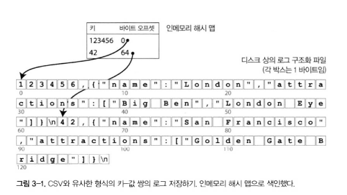
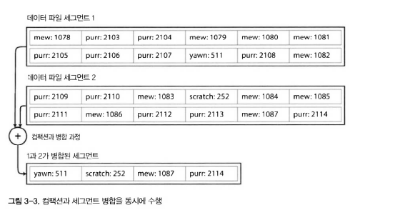
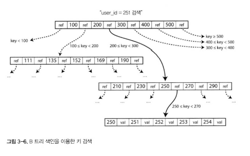
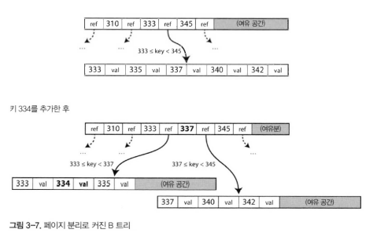
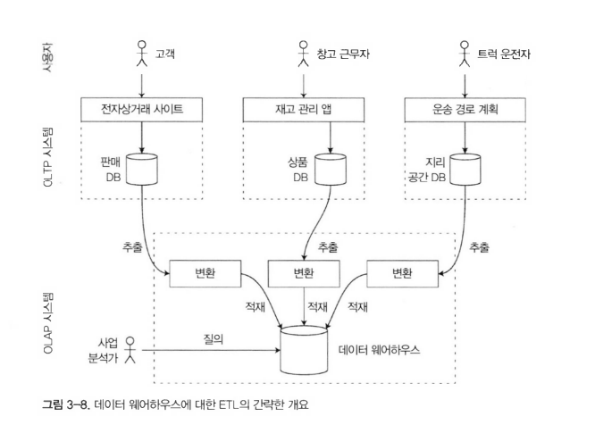
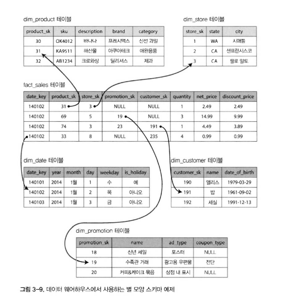
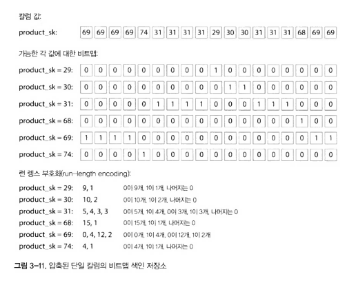
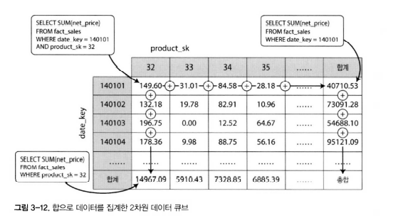

# 🔴 저장소와 검색

3장은 DB가 데이터를 저장하는 방법과 데이터를 요청했을 때 다시 검색하는 방법에 대해 설명하려고 한다.

개발자가 데이터베이스에서 저장과 검색에 대해 알아야 하는 이유
- 여러 DB 중 애플리케이션에 알맞는 DB 엔진을 선택하는 것이 필요하다
- 특정 작업부하(workload) 유형에 좋은 성능을 내게끔 저장소 엔진을 조정하려면 엔진에서 수행되는 작업에 대해 대략적으로 알고 있어야 한다.

엔진 종류
- 트랜잭션에 최적화된 엔진
- 분석에 최적화된 엔진

우선 이번장에서는 DB의 종류 중 RDB, NoSQL이라 불리는 DB에서 사용되는 엔진에 대해 설명한다.
- NoSQL / 로그 구조(log-structure)
- RDB / 페이지 지향(page-oriented, B-tree)

```text
✅ 요약
DB가 저장하는 방법과 저장된 데이터를 요청할때 검색하는 방법에 대해 설명하려고 한다.
저장하려는 데이터에 따라 알맞은 DB 엔진을 선택하는게 필요하고
알맞은 엔진을 선택해야 작업 유형에 따라 성능을 낼 수 있기 때문이다.
종류로는 트랜잭션에 최적화된 엔진, 분석에 최적화된 엔진이 있다.
```

## 🟠 데이터베이스를 강력하게 만드는 데이터 구조

간단한 DB를 만들어보자.

```bash
#!/bin/bash

db_set() {
  echo "$1,$2" >> database
}

db_get () {
  grep "^$1," dtabase | sed -e "s/^$1,//" | tail -n 1
}
```

key-value 형태로 저장하고 값을 가져오는 데이터베이스이다.

```bash
$ db_set 123456 '{"name":"London","attractions":["Big Ben","London Eye"]}'

$ db_set 42 '{"name":"San Francisco","attractions":["Golden Gate Bridge"]}'

$ db_get 42
{"name":"San Francisco","attractions":["Golden Gate Bridge"]}
```

위에는 작동 예시이다.

```bash
$ db_set 42 '{"name":"San Francisco","attractions":["Exploratorium"]}'

$ db_get 42
{"name":"San Francisco","attractions":["Exploratorium"]}

$ cat database
123456,{"name":"London","attractions":["Big Ben","London Eye"]}
42,{"name":"San Francisco","attractions":["Golden Gate Bridge"]}
42,{"name":"San Francisco","attractions":["Exploratorium"]}
```

**db_set** 을 호출하더라도 예전 버전에 덮어 씌우지 않고 계속해서 파일 끝에 추가한다. 최신 값은 key 값의 value에 끝에 있다.(그래서 **db_get** 은 tail -n 1)

`log`
- 쓰기 작업이 매우 빠름
- 많은 DB에서 내부적으로 append-only 방식을 사용함
- 데이터가 많아지면 성능이 좋지 않음
- 매번 키를 검색할 때마다 풀스캔(O(n))

DB의 특정 키값을 효율적으로 찾기 위해서는 `색인`을 사용한다.

`색인`
- 부가적인 메타데이터를 유지하는 것
- 이정표 역할로 원하는 데이터 위치를 빠르게 찾게 해줌
- 기본 데이터(primary data)에서 파생된 추가적인 구조
- DB 데이터 자체적으론 영향이 없으나 질의 성능에 영향을 줌
- 추가적인 구조는 쓰기 과정에서 오버헤드가 발생(비용 발생)
- 쓰기 성능은 로그보다 느림
- 데이터를 쓸때마다 인덱스를 갱신해야 함

log와 색인의 쓰기, 읽기에 대한 성능 차이는 저장소 시스템에서 중요한 트레이드오프다.

색인은 읽기 질의 속도를 향상시키지만 모든 부분에 색인을 설정하면 쓰기 속도를 떨어트린다.

```text
✅ 요약
간단한 key-value 형태의 DB를 직접 만들어보자.
데이터를 계속해서 덮어 씌우는 형태가 아니라 가장 마지막 값으로 추가하는 형태다.
이러한 DB의 장점은 4가지가 있다.
검색에 있어 DB에 저장된 값을 효율적으로 찾기 위해서는 색인이라는 개념을 사용한다.
색인의 특징은 다음과 같다.
하지만 모든 부분에 색인을 설명하면 쓰기의 성능이 저하되기에 중요한 트레이드오프이다.
```

### 🟢 해시 색인

앞의 예제처럼 단순히 파일에 추가하는 방식으로 데이터를 구성할 때 가장 간단한 색인 전략으로 key를 바이트 오프셋에 맵핑해 인메모리 해시맵에 유지하는 전략이 있다.



위 그림과 같이 값(키)와 위치(바이트 오프셋)를 인메모리 해시 맵에 key-value 형태로 등록하여 사용하는 방법이다.

실제 비트캐스트라는 리악(Riak)의 기본 저장소 엔진이 사용하는 방식으로 RAM에 모든 키를 저장한다는 조건을 전제로 고성능 읽기, 쓰기 기능을 보장한다.

`장점`
- 저장소를 모두 검색하는 것이 아닌 짧은 인메모리 해시 맵을 탐색함으로서 빠르게 검색이 가능하다.
- RAM에 적은 용량만 저장하고 실제 데이터는 디스크에 저장하므로 메모리 사용량에서 유리하다.
- 만약 읽으려는 데이터가 이미 OS 캐시에 있다면 디스크를 읽을 필요도 없어 더 빠르다.
- 키값이 자주 갱신되는 상황에 매우 유리하다.
  - 고양이 동영상 URL이 키값, 재생된 횟수가 value인 경우

`단점`

- 파일에 추가만 한다면 결국 디스크 공간이 부족해진다.
  - 세그먼트(segment)로 로그를 나누고 컴팩션(compaction)을 수행하여 해결함
    - 
    - 특정 크기에 도달하면 세그먼트 파일을 닫고 새로운 세그먼트 파일에 이후 쓰기를 수행
    - 새로운 파일에는 중복된 키를 버리고 최신 값만을 저장하여 유지
  - 세그먼트와 컴팩션 수행을 병렬로도 수행함
    - 
    - 여러 세그먼트 파일을 동시에 병합하여 진행할 수도 이다.
    - 최신 세그먼트 확인 -> 2번 세그먼트 확인 -> 1번 세그먼트 확인 순서로 검색을 진행하기 때문에 성능 측면에서 유리함

이러한 구조를 실제로 구현하려면 여러 사항을 고려해야 한다.
1. 파일 형식
   - CSV 형식보단 바이너리 형식을 사용하는 편이 더 빠르고 간단함
2. 레코드 삭제
   - DB에서 삭제할때 삭제 레코드(=tombstone)라는 특수 레코드를 기록함
   - 삭제 레코드가 등록된 값은 다음 세그먼트로 병합될 때 무시됨
3. 고장 복구
    - 서버가 꺼지면 RAM에 등록한 해시 맵이라 다 사라짐
    - DB는 재시작 될때마다 파일 전체를 다시 읽으면서 색인을 등록해야 됨
    - 이를 해결하기 위해 스냅샷을 디스크에 저장해 복구 속도를 높임
4. 부분적으로 레코드 쓰기
   - 데이터를 추가하는 중에 DB가 죽을 수도 있음
   - 체크섬(checksum)을 통해 손상된 데이터를
5. 동시성 제어
   - 추가시에는 단일 쓰레드만 쓰기를 허용한다.
   - 데이터는 모두 불변으로 멀티 스레드에서 동시에 읽기를 허용할 수 있다.

append-only log는 여러 측면에서 좋은 설계다.
- 추가와 세그먼트 병합은 무조건 추가이기 때문에 빠르다.
- 새로운 값이 추가만 되기 때문에 동시성과 복구가 단순하다.
  - 예를 들어 값을 수정하지 않기 때문에 이전 데이터와 새로운 데이터가 모두 파일에 남겨져 있다.
- 세그먼트 병합을 통해 데이터가 계속해서 커지는 것을 방지한다.

하지만 제한 사항도 있다.

- 키가 너무 많아지면 메모리에 부족 문제가 있다.
  - 메모리 대신 디스크를 사용할 순 있지만 성능에서 아쉽다.
  - 메모리 확장 비용이 비싸다.
  - 해시 충돌 해소를 위한 복잡한 로직이 필요하다.
- 범위 질의(range query)에 효율적이지 않다.
  - 범위 검색을 위해서 모든 해시맵을 풀스캔 해야 한다.

```text
✅ 요약
가장 단순한 해시 색인 전략으로는 key 값을 인메모리 해시맵에 등록하는 방법이다.
실제 비트캐스트라는 리악의 기본 저장소 엔진이 모든 key를 인메모리에 저장하여 고성능의 읽기, 쓰기 성능을 보장한다.
장점은 다음과 같다.
단점은 인메모리의 특성상 용량이 적기 때문에 결국 공간이 부족해지는 것이다. 이를 극복하기 위해 컴팩션을 통해 압축을 진행한다.
그리고 이러한 구조를 구현하기 위해서는 5가지의 고려 사항이 있다.
append-only의 개념은 여러 측면에서 좋은 설계이지만 제한 사항도 있다는 것을 알아두자.
```

### 🟢 SS테이블과 LSM 트리

위에서 설명한 로그 저장소는 key-value로 저장하는 저장소이다. 여기에 키로 정렬하는 요구사항을 추가하면 SS테이블(Sorted String Table)이라 한다.

SS테이블은 해시 색인을 가진 로그 세그먼트보다 큰 장점이 있다.
- 세그먼트 병합시 이미 정렬되어 있으므로 효율적으로 병합이 가능하다.(=merge sort)
  - 
  - 새롭게 생성되는 세그먼트도 정렬된 상태로 생성된다.
  - 여러 세그먼트에 같은 키가 있으면 최신 세그먼트 값을 사용하고 오래된 값은 무시한다.
- 메모리에 모든 키를 등록해둘 필요가 없다. 근처 스캔을 하면 된다.
  - 예를 들어 handiwork를 찾으려 할때 키가 등록되어 있지 않더라도 handbag-handsome 키 사이를 스캔하면 된다.
- 레코드들을 블록으로 그룹화하고 압축하여 디스크에 저장한다.
  - 인메모리 색인은 각 압축된 블록의 값을 가진다.
  - 읽기 요청시 압축된 블록만 해제하여 읽으면 되므로 I/O 사용을 줄일 수 있다.
  - 압축하여 저장하므로 디스크 저장 공간에 유리하다.

_SS테이블 생성과 유지_

실제로 데이터를 키로 정렬하는게 쉬울까? 데이터는 순서대로 입력되지 않고 임의의 순서로 입력된다.

디스크에서 정렬된 구조를 유지하는게 가능은 하지만 메모리에서 처리하는 것이 훨씬 쉽다.

red-black tree, AVL tree와 같은 트리 데이터 구조를 사용할 수도 있다.

이제 저장소 엔진을 다음과 같이 만들 수 있다.

- 쓰기 요청이 오면 인메모리 균형 트리(balance tree)에 추가한다.
  - 예를 들어 red-black tree
  - 이때 인메모리 트리는 멤테이블(memtable)이라 한다.
- 멤테이블의 데이터가 임계값보다 커지면 SS테이블로 디스크에 기록한다.
  - 멤테이블에 이미 정렬된 상태로 저장되어 있기 때문에 빠르게 저장이 가능하다.
  - 이때 만들어진 세그먼트가 가장 최신 세그먼트가 된다.
- 읽기 요청이 들어오면 가장 먼저 멤테이블에서 검색한다.
  - 그 후에는 디스크에 저장된 가장 최신의 세그먼트 순서로 검색한다.
- 세그먼트 파일을 합치고 병합하는 컴팩션 과정을 수행한다.

이 계획에는 한가지 문제점이 있다. 만약 DB가 죽으면 인메모리에 저장되어 있던 데이터들은 디스크에 저장되지 못하고 손실된다. 이를 해결하기 위한 방법이 있다.
- 매번 쓰기마다 디스크에 로그로 기록해두어야 한다
- 이 로그는 멤테이블 복구용으로만 쓰이기 때문에 순서를 보장하지 않아도 된다.
- 멤테이블이 디스크에 SS테이블을 기록하고 나면 해당 로그는 삭제한다.

_SS테이블에서 LSM 트리 만들기_

패트릭 오닐(Patrick O'Neil)이 `LSM(Log-Structured Merge-tree) 트리`란 이름으로 지금까지 설명한 내용의 알고리즘을 발표했다. 

또한 LevelDB, RoksDB, Cassandra, HBase 등 DB에서 사용된다.

이 구조는 로그 구조화 파일 시스템에 기반이 됐고 정렬된 파일 병합과 컴팩션 원리를 기반으로 하는 저장소 엔진을 `LSM 저장소 엔진`이라 부른다.

Lucence은 elastic search, solr에서 사용되는 주요 검색 엔진이다. 루씬은 용어 사전을 저장하기 위해 유사한 방법을 사용한다.
- 용어(key), 용어를 포함한 모든 문서의 id 목록 list(value)로 하는 key-value 구조로 구현한다.
- key-value는 SS테이블과 같은 정렬 파일에 유지하고 필요에 따라 병합한다.

_성능 최적화_

- Bloom filter
  - DB에 존재하지 않는 데이터를 검색할 경우 모든 세그먼트를 모두 검색해야 **없다**는 결과를 확인할 수 있음
  - Bloom filter를 통해 존재하지 않는 데이터임을 알려줌으로서 불필요한 디스크 읽기 작업을 방지할 수 있다.
- SS테이블 압축과 병합 전략
  - size-tiered compaction
    - HBase, cassandra
    - 작은 SS테이블을 큰 SS테이블에 연이어 병합한다.
    - 단순해서 쓰기가 빠름
  - leveled compaction
    - level db, roks db, cassandra
    - 더 작은 버무이로 SS테이블을 오래된 순서에 따라 레벨별로 나누어 저장
    - 특정 키를 찾을 때 작은 범위만 보면 되어 읽기에 유리, 컴팩션이 자주 일어나 쓰기에 불리

LSM은 잘 사용한다면 범위 질의를 효율적으로 수행함과 동시에 디스크 쓰기도 빠르기 때문에 매우 높은 읽기, 쓰기 처리량을 보장할 수 있다. 

```text
✅ 요약
SS테이블은 위에 개념에서 세그먼트를 컴팩션 할때 정렬을 한다는 개념이 추가된 것이다.
이러한 부분은 장점을 가진다.
SS테이블로 유지하기 위해 데이터를 정렬하는 방법으로는 red-black tree와 AVL tree와 같은 트리 데이터 구조를 사용할 수 있다.
쓰기 요청이 들어올 때 인메모리에는 멤테이블이라는 트리 구조 데이터로 저장한다.
멤테이블이 임계값보다 커진다면 SS테이블로 디스크에 저장한다.
읽기 요청에서는 멤테이블에서 먼저 조회하기 때문에 빠르다. 없다면 저장된 세그먼트를 뒤져 검색한다.
이것의 단점으로는 DB가 죽어버린다면 인메모리 특성상 데이터가 날라간 다는 것이다. 이를 해결하기 위한 방법이 있다.
패트릭 오닐이 지금까지 설명한 내용의 알고리즘을 LSM트리란 이름으로 발표했다.
LSM트리 구조는 levelDB, RoksDB, cassandra, HBase 등의 DB에서 사용된다.
Lucence은 엘라스틱 서치와 솔라에서 사용되는 주요 검색엔진인데 용어 사전을 저장하기 위해 유사한 방법을 사용한다.
LSM트리의 성능 최적화 방법으로는 Bloom filter와 병합 전략을 생각할 수 있다.
DB에 검색한 값이 없다면 LSM트리는 모든 세그먼트를 뒤진 후에야 없다는 것을 알기 때문에 존재하지 않는 데이터는 Bloom filter를 통해 필터링 할 수 있다.
- Bloom filter는 해당 key 값이 DB에 있다 or 없다만 저장하는 filter
SS테이블로 압축과 병합하는 방법으로는 단순히 사이즈가 작은 SS테이블을 큰 SS테이블에 연이어 병합하는 방법과 쓰기시 겹친 횟수에 따라 level 별로 나누어 저장하는 방법이 있다.
- size-tiered compaction 단순히 합치는 방법은 쓰기에서 간단하기 때문에 성능이 좋지만 검색시 겹친 키값이 있다면 흩어져 있는 키를 모두 조회하기 때문에 읽기 성능이 느림
- leveled compaction 겹치는 키가 생기면 level로 분리해서 정리하기 때문에 검색시 해당 키의 가장 높은 레벨을 검색하면 되어 읽기에 유리함 대신 쓰기시에 레벨별로 분리해야 되기 때문에 성능이 느림 
```

### 🟢 B트리

로그 구조화 색인보다는 B-tree구조가 가장 널리 사용되는 구조이고 둘은 상당히 다르다.

B-tree는 1970년에 등장했고 10년도 안돼 보편화되었다. 그 후 지금까지 RDB, NoSQL의 표준으로서 사용되고 있다.

B-tree는 SS테이블과 같이 key-value 구조로 키로 정렬된 값을 유지하기에 range query에 유리하다. 로그와 비슷한점은 이게 전부고 이 외에는 전부 다르다.



- 4Kb(때로는 더 큰 크기로) 고정 크기 블록이나 페이지로 나누어 한번에 하나의 페이지를 읽거나 쓰기를 진행한다.
  - 이러한 설계는 하드웨어와 밀접한 관련이 있다.
- 각 페이지는 주소나 위치를 이용하여 식별한다.
  - 이 방법으로 하나의 페이지가 다른 페이지를 차조할 수 있다.
- 한 페이지는 B트리의 Root로 지정된다.
- 색인은 루트에서부터 시작된다.
- 하위 페이지는 키가 계속 이어지는 범위에 대한 정보를 담당하고 참조 사이의 키는 해당 범위 경계가 어디인지 나타낸다.
- 위 그림에서 **251**을 찾고 있다. 그렇기에 200~300의 범위 검색을 진행하고 그 이후엔 250의 더 좁은 범위로 탐색을 진행한다.
- 최종적으로는 leaf page에 도달한다.
- 한 페이지에서 하위 페이지를 참조하는 수를 분기 계수(branching factor)라 부른다.
  - 현재 그림에서는 분기 계수는 6개이다.(ref의 수)
  - 분기 계수는 페이지 참조와 범위 경계를 저장할 공간의 양을 말하고 보통은 수백개에 달한다.
- B-tree에서 키의 값을 갱신하는 경우엔 리프 페이지를 검색하고 페이지의 값을 바꾼 다음 페이지를 디스크에 다시 기록한다.
  - 페이지에 대한 참조는 동일하게 유지된다.
- 새로운 키를 추가하면 새로운 키를 포함하는 범위의 페이지를 찾아 해당 페이지에 키와 값을 추가한다.
- 새로운 키를 수용할 페이지에 여유 공간이 없다면 페이지 하나를 반쯤 채워진 페이지 둘로 나누고 상위 페이지가 새로운 키 범위의 하위 부분들을 참조할 수 있도록 갱신한다.
  - 
  - 위 그림처럼 페이지가 가득 찼다면 페이지를 둘로 나누고 상위 페이지에 새로운 참조 값을 기록한다.

이러한 알고리즘을 통해 트리가 균형을 유지하는 것을 보장한다.

n개의 키를 가진 B-tree는 깊이가 항상 O(log n)이다. 대부분 데이터베이스는 B-tree 깊이가 3~4단계면 충분하므로 검색을 위해 많은 페이지 탐색이 일어나지 않는다.(예를 들어 분기 계수 500의 4Kb 페이지의 4단계 트리는 256TB까지 저장이 가능하다.)

_신뢰할 수 있는 B트리 만들기_

B-tree의 기본 수정 쓰기 동작은 동일한 페이지 위치에 새로운 데이터를 디스크 상에 덮어 쓰기이다. 즉 덮어 쓰더라도 페이지를 가리키는 모든 참조는 그대로 남는다. 

이 동작은 LSM 트리와 같은 로그 구조화 색인과 대조되는 점이다. 로그 구조화 색인은 파일을 추가만 할 뿐 기존 파일에 대해 수정하지 않기 때문이다.

덮어 쓰기는 여러 문제점을 만들 수 있다.

1. 하드웨어 측면에서 복잡성
   - HDD의 경우 디스크 헤드가 해당 위치로 이동하고 플래터가 돌아서 원하는 위치에 올때까지 기다렸다가 덮어쓰기가 된다.
      - 덮어쓰는데 시간이 오래 걸린다.
   - SSD의 경우 블록 단위로 한번에 지우고 다시 쓰는 복잡한 동작을 한다.
2. 고아 페이지(orphan page)
   - 고아 페이지는 어떤 페이지와도 부모 관계가 없는 페이지를 말한다.
   - 일부 동작은 여러 페이지를 한번에 덮어쓰기가 필요한 경우도 있다. 예를 들어 삽입 때문에 페이지가 너무 많아져 페이지를 나눠야 한다면 분할된 두 페이지를 기록하고 하위 페이지 참조를 갱신하게끔 상위 페이지를 덮어 써야 한다.
     이때 일부 페이지만 수정된 후 DB가 죽어버린다면 색인이 훼손되기 때문에 이는 매우 위험하다. 이로 인해 고아 페이지(orpan page)가 발생할 수 있다.
   - 이 문제 해결을 위해 WAL(wirte-ahead log)나 재실행 로그(redo)라는 데이터 구조를 추가하여 복구될 때 일관성 있는 상태를 보장한다.
3. 동시성 제어
   - 다중 스레드가 동시에 B-tree에 접근하면 같은 자리를 동시에 갱신한다. 이는 스레드 일관성이 깨진 상태로 접근할 수 있기에 주의 해야 한다.
     - latch/lock을 통해 데이터 일관성을 보장한다.

로그 구조화에서 새롭게 데이터를 추가하는 방식이 이러한 문제에서는 더 쉽게 문제들이 해결된다. 

_B트리 최적화_

- 쓰기를 2번 실행하게 되는 WAL 대신 일부 데이터베이스는 쓰기 시 복사 방식(copy-on write scheme)을 사용한다.
  - 변경되는 페이지는 다른 페이지에 기록하고 트리에 상위 페이지에 새로운 버전을 만든다.
  - 이 방식은 동시성에도 유리하다.
- 전체 키를 저장하는게 아닌 축약해 저장하여 저장 공간을 정량갛ㄴ다.
  - 키는 범위에 대한 정보만 있으면 되기 때문
  - 키를 절약하면 더 높은 분기 계수를 얻을 수 있고 그러면 트리의 깊이 수준을 낮출 수 있다.
- 연속된 읽기가 가능하도록 정렬하여 저장하려고 한다.
  - 하지만 데이터가 많아지면 순서를 유지하기 어렵다.
  - 반대로 LSM 트리는 컴팩션 과정에서 순서를 정렬하여 저장해두기 때문에 유리하다.
- 트리에 포인터르 추가한다.
  - 각 리프 페이지가 양쪽 형제 페이지에 대한 Next, Prev와 같은 정보를 추가한다면 부모 페이지를 조회해서 다시 리프로 갈 필요가 없이 바로 연속된 조회가 가능해진다.
- 프랙탈 트리(gractal tree) 같은 B-tree 변형은 조회 성능을 위해 로그 구조화 개념을 일부 사용하기도 한다.
  - 데이터를 버퍼에 모아두었다가 한번에 이동할때 정리함.

```text
1970년 등장한 비트리는 현재까지도 RDB, NoSQL에서 표준으로 사용되고 있다.
비트리의 개념에 대해서는 다음과 같다.
이러한 알고리즘을 통해 트리 균형을 유지하는 것을 보장한다.
비트리는 항상 O(log n)을 보장한다.
비트리는 수정이 생긴다면 덮어쓰기를 실행하기 때문에 문제점을 만들 수 있다.
이러한 문제는 로그 구조화 저장소에서는 쉽게 해결되지만 비트리에서는 고려해야하는 부분이 된다.
그리고 비트리를 최적화하는 방법이 있다.
```

### 🟢 B트리와 LSM 트리 비교

B트리가 오래 사용되어 왔고 구현 성숙도가 높지만 LSM 트리도 장점 때문에 관심을 받고 있다.

경험 적으로 LSM 트리는 쓰기에 빠르고 B트리는 읽기에 빠르다.

이번 장에서는 저장소 에닞ㄴ의 성능을 측정할 때 고려하면 좋은 사항들에 대해 설명한다.

_LSM 트리의 장점_

B트리 색인은 데이터를 쓰기할 때 최소 2번 기록된다. 쓰기 전 로그에 기록, 트리 페이지에 한번. 그리고 수정을 할 때 몇 바이트만 바뀌어도 전체 페이지를 다시 기록해야하는 오버헤드도 있다. 일부 저장소 엔진은 장애가 발생했을 땐 일부만 갱신된 페이지로 종료되지 않도록 동일한 페이지를 두 번 덮어쓴다.

로그 구조화 색인 또한 SS테이블의 반복된 컴팩션과 병합을 진행하며 여러번 데이터를 쓰기 진행한다.

이렇게 데이터를 쓰기 진행할 때 여러번 쓰기가 발생하는 것을 **쓰기 증폭(write amplification)**이라 한다. 특히 SSD는 덮어쓰기 횟수가 제한되기 때문에 특별히 관심을 가지게 된다.

쓰기가 많이 발생하는 애플리케이션에서는 데이터베이스에서 쓰기가 하드웨어의 성능과 연관되어 성능 병목이 있을 수 있다. 이런 경우에는 쓰기 증폭이 바로 성능과 연결된다.

이러한 부분에서 LSM 트리의 장점이 있다.

1. LSM트리는 B트리보다 쓰기 처리량에서 효율이 좋다.
   - LSM트리가 상대적으로 쓰기 증폭이 낮다. 페이지를 덮어 쓰는게 아닌 순차적으로 파일을 쓰기만 하기 때문이다.
   - SSD에서 이러한 특징으로 LSM트리가 유리하다.
2. LSM 트리는 압축률이 좋다.
   - B트리에 비해 디스크에 더 적은 파일을 생선한다.
   - B트리는 파편화로 페이지에 여유 공간을 위해 사용하지 않는 디스크 공간을 점유한다.
   - LSM 트리는 주기적으로 컴팩션을 진행하며 SS테이블로 기록해두기 때문에 압축률이 더 높다. leveled compaction 전략을 사용하면 특히 그렇다.
3. SSD에서 유리하다.
    - 대부분의 SSD 펌웨어에서 임의 쓰기를 순차 쓰기로 전환하여 사용하기에 무조건 LSM 트리가 유리하다고 할순 없긴 하다.
    - 낮은 쓰기 증폭과 압축률은 SSD에서 유리한 것은 확실하다.
    - 데이터를 압축해 두어 빠르게 읽기가 가능하다.
    - 쓰기 데이터를 모아두었다가 한번에 쓰기를 진행하므로 빠르게 쓰기가 가능하다.

_LSM 트리의 단점_

1. 컴팩션 과정으로 인한 부하
   - 컴팩션 과정으로 인해 읽기와 쓰기 성능에 영향
   - 동시성 제어를 위해 컴팩션 진행 중에는 읽기 or 쓰기에 대해 대기를 진행하는데 컴팩션 과정은 디스크에서 비싼 과정이라 응답 시간이 느려질 수 있다.
   - 이러한 부분으로 인해 B트리에 비해 성능을 예측하기 어렵다.
2. 높은 쓰기 비율
   - 데이터를 쓰기 위한 스레드와 멤테이블을 SS테이블로 컴팩션하는 쓰기가 모두 하나의 디스크 쓰기 대역폭을 공유한다.
   - 디스크가 초당 쓸 수 있는 최대 데이터양을 공유해야 하기에 성능에 병목이 생길 수 있다.
3. 명시적 모니터링 필요
   - 세그먼트는 디스크가 모두 꽉 찰때까지 계속해서 증가한다.
   - 계속 증가되는 세그먼트는 읽기 요청시 더 많은 세그먼트를 확인해야되는 결과로 이어져 읽기가 느려진다.
   - 이러한 부분을 개발자가 직접 모니터링하며 튜닝해주어야 한다.
4. RDB에는 B트리가 더 잘 어울린다.
   - B트리는 각 키가 색인의 한곳에만 정확히 존재하지만 LSM트리는 같은 키 값이 여러 세그먼트에 존재할 수 있다.
   - B트리는 색인에서 직접 lock을 진행하기에 강력한 트랜잭션 격리가 필요한 RDB에 더 어울린다.

B트리는 DB 아키텍처에서 예전부터 사용되어 지고 있다. 또한 성능적으로도 좋기에 사라질 가능성은 없다.

반면 새로운 데이터 저장소에서는 로그 구조화 색인이 점점 등장하고 있다. 적절한 사용 사례에 따라 적합한 저장소 엔진 유형을 결정은 아직 없기 때문에 경험과 테스트를 통해 더 좋은 저장소 엔진을 선택하는 방법도 괜찮다.

```text
✅ 요약
비트리가 오래 사용되어 왔고 구현 성숙도가 높지만 LSM트리의 장점들로 인해 관심을 받고 있다.
LSM트리는 쓰기에 빠르고 비트리는 읽기에 빠르다.
LSM트리의 장점과 단점에 대해 살펴보자.
비트리의 색인 작업을 위해 쓰기 발생시 최소 2번의 기록이 진행된다. 로그에 기록, 트리 페이지에 기록 그리고 수정할때 조금의 수정으로 전체 페이지를 전부 다시 기록해야하는 오버헤드도 있다.
LSM트리도 색인을 할때 여러번 데이터 쓰기가 진행되는 것은 마찬가지다.
이렇게 쓰기를 진행할때 여러번 쓰기가 진해오디는 것을 쓰기 증폭이라 한다. 특히 쓰기 증폭은 SSD와 연관되어 있어 성능과 연결된다.
LSM트리의 장점,과 단점에 대해 설명
요즘 새로운 저장소들은 로그 구조화 색인이 점점 등장한다. 아직 어떤 점이 더 좋다고 할순 없기 때문에 경험과 테스트를 통해 더 좋은 저장소 엔진을 선택하자.
```

### 🟢 기타 색인 구조

지금까진 key-value 형태의 색인을 살펴봤다. key-value 색인은 RDB에서 primary key 색인이 대표적인 예이다.

기본키로 RDB에서는 하나의 로우, 문서형 DB에서는 하나의 문서, 그래프형 DB에서는 하나의 정점을 고유하게 식별하는데 사용된다.

보조 색인(secondary index)를 사용하는 것도 일반적인 방법이다. 보조 색인은 보통 효율적인 join을 위해 사용된다.

기본키 색인과 차이점은 키가 고유하지 않을 수 있다는 점이다. 키를 가진 많은 로우가 있을 수 있다.

이러한 중복 문제를 해결하기 위해 두가지 방법이 있다.
1. 색인 값에 일치하는 로우 리스트를 만들어 방법
2. 색인에 유니크한 로우 식별자를 추가해 고유하게 만드는 방법

_색인 안에 값 저장하기_

색인에서 키는 질의어가 검색하는 대상이지만 값은 두가지를 의미한다.
1. 값은 실제 로우
2. 다른 곳에 저장된 로우를 가르키는 참조
   - 참조인 경우 heap file이라 하고 특정 순서 없이 데이터를 저장한다.

색인 안에 파일을 저장하는 방식도 여러 방법이 있다.
1. heap file 저장 방식
   - 색인은 힙 파일에서 위치만 참조하고 실제 데이터는 다른 저장 공간에서 가져온다.
   - heap file 형식은 여러 보조 색인이 존재할 때 데이터 중복을 피할 수 있다.
   - 저장 공간이 많이 필요할 경우 읽기 성능에서 불리하다.
2. 클러스터드 색인(clustered index)
   - 색인안에 바로 로우 자체를 저장한다.
   - MySQL의 InnoDB 엔진에서 사용된다. MS SQL에서도 사용할 수 있다.
   - 기본키가 언제나 클러스터드 색인이고 보조 색인은 heap file이 아닌 기본키를 참조한다.
3. 커버링 색인(covering index) or 포괄열이 있는 색인(index with included column)
    - 클러스터 색인(색인 내에 데이터를 저장)과 비클러스터드 색인(색인 안에 참조만 저장)의 절충안
    - 색인 안에 일부 컬럼을 저장해두어 일부의 질에에는 바로 응답이 가능하다. (이런 경우를 색인의 질의를 커버했다라고 한다.)

모든 색인은 읽기 성능을 높일 수 있지만 추가적인 저장소가 필요해지고 쓰기 과정에서 오버헤드가 발생한다. 또한 애플리케이션 단에서 복제로 인한 불일치를 파악할 수 없기 때문에 트랜잭션 보장 강화를 위해 개발자의 노력이 필요해진다. 

_다중 칼럼 색인_

지금까지 설명한 색인은 하나의 키만 적용된다. 다중 컬럼에 동시에 질의해야 하는 경우에는 다중 컬럼 색인이 필요하다.

1. 결합 색인(concatenated index)
    - 하나의 키에 여러 필드를 단순히 이어 붙인다.
    - 성,이름(key) - 전화번호(value) 목차로 제공하는 종이 전화번호부와 유사하다.
    - 순서가 정렬되어 있어 특정 성을 가진 모든 사람을 찾거나 특정 성+이름 조합을 가진 모든 사람을 찾을때 색인이 사용 가능하다.
    - 하지만 특정 이름만 검색할 경우에는 쓸모가 없다.
2. 다차원 색인
    - 지리 공간 데이터에서 중요하게 사용됨
    - B트리와 LSM트리 색인은 아래와 같은 2개의 범위 질의에 효율적으로 응답할 수 없다.
      ```sql
      select * from restaurants 
      where latitude > 51.4946 and latitude < 51.5079
      and longitude > -0.1162 and longitude < -0.1004;
      ```
    - 해결방법으로는 공간 채움 곡선(space-filling curve)을 이용해 이차원 위치를 단일 숫자로 변환한 다음 B트리 색일을 사용한다.
    - 다른 방법으로는 전문 공간 색인(specialized spatial index)을 사용하는 것이다. PostgreSQL의 PostGIS는 R트리(Rectangle Tree) 같은 지리 공간 색인을 구현했다.

흥미로운 점은 다차원 색인의 활용이 지리 공간 데이터에서만 사용되는 것이 아니다.

예를들어 전자상거래 웹사이트에서 특정 색상(빨강, 초록, 파랑) 범위 검색을 위해 3차원 색인을 사용하거나 날씨 관측에서 (날짜, 기온)의 2차원 색인을 사용하기도 한다.

이러한 기법을 HyperDex(NoSQL DB)에서 사용한다.

_전문 검색과 퍼지 색인_

지금까지 설명한 모든 색인은 정확한 데이터를 대상으로 키의 정확한 값이나 정렬된 키의 값의 범위를 질의할 수 있다. 
이 색인으로는 철자가 틀린 단어나 유사한 키에 대해서는 검색할 수 없다. 
이런 애매모호(fuzzy)한 질의에는 다른 기술이 필요하다.

전문 검색엔진은 특정 단어를 검색할 때 동의어 질의를 확장한다. 
- 단어의 동일한 문서에서 서로 인접해 나타난 단어를 검색
- 언어학적으로 텍스트를 분석해 사용하는 등 다양한 기능을 제공

루씬은 문서나 질의 오타에 대처하기 위해 특정 편집 거리(edit distance) 내에 단어를 검색할 수 있다.
- edit distance가 1이라면 1개의 단어가 틀려도 검색 결과로 노출시켜준다.
- 예를 들어 apple을 검색하기 위해 aple로 검색해도 결과 노출
- SS테이블 같은 구조를 통해 용어 사전을 만들어 둔다.
- 인메모리 구조로 색인을 만들어 둔다.
- 인메모리 색인은 키에 대해 유한 상태 오토마톤(finite state automaton)으로 트라이(trie)와 유사하다.
  - trie는 문자열을 저장하는 트리 구조이다. 각 노드는 문자 하나를 저장하고 루트부터 내려가면 문자열이 완성되는 구조다.
- 이 유한 상태 오토마톤은 레벤슈타인 오토마톤(levenshtein automaton)으로 변환할 수 있다.
  - 특정 편집 거리(edit distance) 내에서 검색 기능을 제공한다.

그 밖에 퍼지 검색 기술은 문서 분류 및 머신러닝의 방향으로 진행되고 있다.

_모든 것을 메모리에 보관_

지금까지 설명한 데이터 구조는 모두 디스크 한계에 대한 해결책에 대한 내용이였다.

디스크는 좋은 성능을 위해서 고려해야될 부분들이 많다. 이런 단점들에도 디스크를 사용하는 이유는 2가지이다.

1. 지속성(전원이 꺼져도 데이터가 손실되지 않는다.)
2. 메모리(RAM)보다 가격이 저렴하다.
   - RAM도 점점 저렴해져 가격 논쟁은 약해졌다.

데이터를 저장하는 용량이 크지 않을 경우에는 디스크 말고 메모리에 데이터를 전부 보관하는 인메모리 데이터베이스에 전부 보관하는 방식도 꽤 현실적이다.

멤캐시드 같은 일부 인메모리 저장소는 재시작되면 데이터 손실을 허용하는 캐시 용도로만 사용된다. 하지만 지속성을 목표로 하는 인메모리 데이터 베이스도 ㅎ있다.

- 배터리 전원 공급 RAM과 같은 특수 하드웨어를 사용
- 디스크에 변경 사항의 로그를 기록(스냡샷)하여 재시작 시 데이터 복원
  - 디스크에 내용을 기록하더라도 여전히 인메모리 저장소인 이유는 디스크는 단지 지속성을 위한 용도이고 모든 읽기는 인메모리에서 제공하기 때문
  - 디스크에 기록하는 방식은 쉽게 백업이 가능하고 외부 유틸리티를 사용함에 있어 운영적인 장점도 있다.

인메모리 DB 제품
- VoltDB, MemSQL, Oracle timesTen 같은 관계형 인메모리 DB
- RAMCloud 오픈소스 인메모리 key-value 저장소
- Reids, Couchbase 비동기로 디스크에 기록하는 약한 지속성 제공 DB

디스크는 OS에서 최근에 사용한 디스크 블록을 캐시하여 제공하기도 하는데 인메모리는 OS 캐시를 사용하지 않기 때문에 오히려 데이터를 기록하기 위한 오버헤드를 피할 수 있어 더 빠르다.

인메모리 데이터베이스는 메모리 자체적으로 데이터를 가지고 있기 때문에 디스크 기반 색인으로 구현하기 어려운 우선순위 큐, set과 같은 다양한 자료구조를 제공할 수 있다.

디스크 중심 아키텍처에서 디스크에 기록하고 디스크에서 읽어와서 메모리에 등록해야 하는 오버헤드가 있다. 

인메모리 데이터베이스는 메모리 자체적으로 등록되어 있기에 이러한 오버헤드가 없는데 메모리가 부족할 수 있는 문제가 있다. 이런 문제를 해결하기 위해 안티 캐싱(anti-caching)을 사용한다.
- 메모리가 충분하지 않을 때 메모리에 있는 데이터를 디스크로 보내고 나중에 접근할 때 다시 메모리에 적재하는 방식으로 동작한다.
- 모든 읽기가 디스크에서 가져와 메모리에 적재하여 노출하는 디스크 방식보다 효율적이고 메모리 부족 문제도 해결할 수 있다.

비휘발성 메모리(non-volatile memory, NVM)은 앞으로 계속 널리 사용되며 연구되고 있기 때문에 계속 주목할만한 기술이다. 

## 🟠 트랜잭션 처리나 분석?

트랜잭션의 단어는 이전에는 비즈니스에 대한 처리를 의마하는 커머셜 트랜잭션(commercial transaction 상거래)에 해당했다.

현재는 비즈니스 뿐만 아닌 여러 데이터 종류에 사용되고 있다.(블로그 댓글, 게임 액션, 주소의 연락처 등) 이러한 패턴을 온라인 트랜잭션 처리(online transaction processing, OLTP)라고 한다.

또한 데이터 분석(data analytic)에도 많이 사용되고 있는데 이를 온라인 분석 처리(online analytic processing, OLAP)라고 부른다. 

| 특성       | OLTP (트랜잭션)       | OLAP (분석)                   |
|----------|--------------------------|-----------------------------|
| 주요 읽기 패턴 | 질의당 적은 수의 레코드, 키 기준으로 가져옴 | 많은 레코드에 대한 집계               |
| 쓰기 패턴    | 임의 접근, 사용자가 자주 등록        | bulk, ETL 또는 이벤트 스트림 |
| 사용 대상    | 사용자/소비자                  | 의사결정 지원을 위한 분석가             |
| 데이터 표현   | 데이터의 최신 상태               | 시간에이 지나며 일어난 이벤트 이력         |
| 데이터셋 크기  | GB ~ TB                  | TB ~ PB                     |

```text
ETL은 Extract, Transform, Load 으로

Extract (추출): 여러 소스(운영 DB, 로그, API 등)에서 데이터를 가져옴
Transform (변환): 가져온 데이터를 분석하기 좋게 가공함
Load (적재): 변환된 데이터를 데이터 웨어하우스 같은 분석용 DB에 저장

batch나 이벤트 스트림 처리를 통해 데이터 가공하는 과정을 말한다.
```

SQL은 OLTP뿐 아니라 OLAP에서도 유연하게 잘 동작했지만 1980년 후반부터 데이터 웨어 하우스(data warehouse)라는 개별 데이터베이스를 통해 분석을 진행했다. 

### 🟢 데이터 웨어하우징

기업은 수십 가지의 트랜잭션 시스템을 갖추고 있다.
- 고객 대면 웹사이트 강화
- 판매 계산 시스템 관리
- 창고 재고 조사
- 운송 수단 경로 계획
- 공급업체 관리
- 직원 관리

이런 시스템들은 복잡해서 유지보수를 위한 팀이 필요하기 때문에 보통 서로 독자적으로 운영된다.

OLTP 시스템은 높은 가용성과 낮은 latency의 트랜잭션 처리를 기대한다. 그렇기에 비용이 비싼 즉석 분석 질의(ad hoc analytic query)를 OLTP에 직접 질의하는 것은 성능 저하를 일으킬 수 있다.

데이터 웨어하우스는 OLTP 작업에 영향을 주지 않고 마음껏 질의할 수 있는 개별 데이터베이스다.
- 회사 내의 모든 다양한 OLTP 시스템의 복사본
- 주기적으로 덤프나 갱신 스트림을 사용해 ELT(extract-transform-load)한다.
  - 

현재 모든 대기업에는 데이터 웨어하우스가 있지만 소규모 기업은 그렇지 않다. 소규모 기업은 많은 OLTP 시스템을 가지고 있지도 않고 데이터도 적기 때문이다.

분석을 위해 OLTP 시스템 대신 웨어하우스를 사용하는 큰 장점은 분석 접근 패턴에 맞게 최적화할 수 있다는 점이다.

_OLTP 데이터베이스와 데이터 웨어하우스의 차이점_

데이터 웨어하우스는 SQL 질의가 적합하기도 하고 관계형 모델은 사용한다.

SQL 질의를 생성하고 결과를 시각화하고 분석가가 작업을 통해 데이터를 탐색할 수 있게 해주는 그래픽 데이터 분석도구가 있다.
- 드릴다운(drill-down): 세부 데이터로 점점 내려가며 탐색
- 슬라이싱(slicing): 특정 조건으로 잘라내어 탐색
- 다이싱(dicing): 다차원으로 쪼개서 비교

RDB와 데이터 웨어하우스를 모두 지원하는 제품이 있다.
- MS SQL
- SAP HANA

사용 라이센스로 데이터 웨어하우스 지원
- 테라데이터(Teradata)
- 버티카(Vertica)
- SAP HANA
- 파르에어셀(ParAccel)
  - Amazon RedShift: 아마존에서 cloud로 제공하는 파르에어셀 기반

SQL 온 하둡(SQL-on Haddop) - 오픈소스로 데이터 웨어하우스 지원(이중 일부는 구글의 드레멜에서 가져온 개념을 기반으로 한다.)
- 아파치 하이브(Apache Hive)
- 스파크 SQL(Spark SQL)
- 클라우데라 임팔라(Cloudera Impala)
- 페이스북 프레스토(Facebook Presto)
- 아파치 타조(Apache Tajo)
- 아파치 드릴(Apache Drill)

### 🟢 분석용 스키마: 별 모양 스키마와 눈꽃송이 모양 스키마

OLPT 모델에 비해 OLAP는 데이터 모델의 다양성이 훨씬 적다. 많은 데이터 웨어하우스는 별모양 스키마(star schema) = 차원 모델링(dimensional modeling)으로 알려진 정형화된 방식을 사용한다.



해당 예제는 식료품 소매업에서 볼 수 있는 데이터 웨어하우스를 나타낸다.

스키마 중심에는 사실 테이블(fact table = fact sales)이 있다.  
- 특정 시각에 발생한 이벤트
- 예시에서는 고객의 제품 구매에 해당
- 웹사이트라면 판매가 아닌 고객의 클릭
- 개별 이벤트만을 담는다. 나중에 분석의 유연성을 극대화할 수 있기 때문
- 개별 이벤트만을 담다보니 데이터가 매우 커질 수 있다.
  - 애플, 월마트, 이베이 같은 대기업은 데이터 웨어하우스에 수십 페타바이트의 트랜잭션 내역을 저장하고 있고 대부분은 사실 테이블이다.

사실 테이블에서 다른 테이블을 가리키는 외래 참조키가 있다. 참조되는 테이블은 차원 테이블(dimension table)이라 부른다.
- 누가(Who), 언제(When), 어디서(Where), 무엇을(What), 어떻게(How), 왜(Why)를 나타냄
- 예시에서 **dim_product** table은 stock-keeping unit, description, brand name, category, fat content, package size 등 제품의 설명을 나타낸다.

별 모양 스키마란 이름은 테이블 관계가 시각화될 때 사실 테이블을 가운데 두고 차원 테이블로 둘러싸고 있어 별 모양 스키마라 부른다.

별 모양 스키마의 차원 테이블을 더 세분화하는 방법을 눈꽃송이 모양 스키마(snowflake scheme)이라 부른다.
- 예를 들어 브랜드와 제품 범주의 테이블을 분리할 수 있고 **dim_proudct** 테이블의 각 로우는 문자열로 브랜드를 저장하는 대신 참조로 바꿀 수 있다.
- 별모양 스키마보다 더 정규화되어 있는 데이터지만 분석가들은 별 모양 스키마를 작업하기 쉽다는 이유로 더 선호한다.


## 🟠 칼럼 지향 저장소

사실 테이블에 많은 로우가 쌓이면 효율적으로 저장하고 질의하는데 어려움이 생긴다.

사실 테이블에서는 보통 컬럼이 100개 이상이지만 일반적인 데이터 웨어하우스에서는 4~5개 컬럼만 있으면 된다.

```sql
SELECT
    dim_date.weekday, dim_product.category,
    SUM(fact_sales.quantity) AS quantity_sold
FROM fact_sales
JOIN dim_date ON fact_sales.date_key = dim_date.date_key
JOIN dim_product ON fact_sales.product_sk = dim_product.product_sk
WHERE
    dim_date.year = 2013 AND
    dim_product.category IN ('Fresh fruit', 'Candy')
GROUP BY
    dim_date.weekday, dim_product.category;
```

이 질의는 수많은 컬럼에 접근하지만 사실 date_key, product_sk, quantity 3개의 컬럼만 필요하다.

대부분의 OLTP DB는 row 지향 방식으로 데이터를 배치한다. 테이블에서 한 로우의 모든 값은 서로 인접하게 저장된다.

위 쿼리를 실행한다고 했을때 3개의 컬럼에 대한 질의를 실행하기 위해 모든 로우를 메모리로 적재한 후 구문을 해석하여 필터링해야 하는 작업이 필요하다.

이를 해결하기 위해 컬럼 지향 저장소의 개념이 등장했다.
- 모든 값을 하나의 로우에 저장하지 않고 각 컬럼별로 저장한다는 것이다.
- 각 컬럼을 개별 파일에 저장해두면 질의에 사용되는 컬럼만 읽으면 된다.
- 모든 row를 읽어서 처리하는 것보다 훨씬 작업량에서 유리하다.
- 

### 🟢 칼럼 압축

질의에 필요한 컬럼을 압축하면 처리량을 더 줄일 수 있다. 다행히 컬럼 지향 저장소는 압축에 적합하다.



비트맵 부호화(bitmap encoding)
- 예시 그림처럼 같은 값이 반복적으로 저장되는 데이터가 있을 때 압축할 수 있다.
- 예를 들어 제품은 10만개인데 판매건이 수십억건인 경우 수십억 건의 데이터를 10만개로 줄일 수 있다.
- 고유 값이 1개라면 1개의 bitmap row로만 표현이 가능
- 반대로 고유 값이 n개로 더 많다면 0으로 채워지는 데이터 부분으로 인해 메모리 낭비가 생김
  - 이런 문제를 희소(sparse)라고 표현함
  - 문제 해결을 위해 그림과 같이 런 렝스 부호화(run-length encoding)을 진행함
  - 0의 개수 길이와 1의 개수 길이를 숫자로 그대로 표현하여 저장함으로 메모리 낭비 문제를 해결

```sql
WHEHE product_sk IN (30, 68, 69);
```

prudct_sk = 30, prudct_sk = 68, prudct_sk = 69에 대한 비트맵 세개를 적재하여 OR 연산한다.

```sql
WHEHE product_sk = 31 AND store_sk = 3;
```

prudct_sk = 31, store_sk = 3 비트맵을 적재하고 AND 계산한다.

이러한 쿼리 조건이 있을때 비트맵 부호화를 통해 빠르게 연산이 가능하다.

_메모리 대역폭과 벡터화 처리_

데이터 웨어하우스의 질의는 수백만 로우를 스캔하는 만큼 많은 병목이 있다.
- 많은 데이터를 디스크로부터 메모리로 데이터를 가져오는 대역폭 병목
- CPU 분기 예측 실패(branch misprediction), 버블(buble)과 같은 이슈
  - 분기 예측 실패: if와 같은 분기 조건에서 예측을 실패하여 작업이 늦춰지는 현상
  - 버블: 앞선 작업의 이슈로 인해 뒤에 작업들이 같이 밀리는 현상
- 이러한 문제 해결을 위해 최신 CPU의 경우 단일 명령 다중 데이터 명령(single-instruction-multi-data, SIMD)를 사용하도록 개발자가 신경 써야함

컬럼 저장소 배치는 디스크 용량을 줄이는 것 외에도 CPU를 효율적으로 사용하기에 적합하다.
- 압축된 컬럼 데이터를 CPU L1 캐시에 딱 맞게 가져오고 이를 타이트 루프에서 빠르게 반복한다.
  - tight loop: 불필요한 작업 없이 진행되는 반복문
- L1 캐시에 더 많은 데이터를 저장할 수 있다.
- 비트 AND와 OR 연산자는 일반 row를 하나씩 검사하는 것보다 압축된 컬럼에서 한번에 처리하기에 더 빠르게 연산할 수 있다.
- 이러한 설계 기법을 벡터화 처리(vectorized processing)이라 한다.

### 🟢 칼럼 저장소의 순서 정렬

컬럼 저장소에서 로우가 저장되는 순서는 중요하지 않지만 SS테이블에서 했던 것처럼 정렬을 한다면 이를 색인 매커니즘처럼 사용할 수 있다.

각 컬럼들의 데이터들은 서로 row로 연관되어 있기에 독립적으로 정렬할 순 없다. 

그렇기에 1차 정렬키를 정하고 1차 정렬키가 같은 값들에 한해서 2차 정렬 키를 정해서 적용할 수 있다.
- 예를 들어 질의가 지난 달(last month)처럼 시간 범위를 목표로 한다면 1차 정렬키를 date_key로 한다.
- 그후 같은 날짜에 판매한 제품을 함께 그룹화 할수 있게 product_sk를 보조 정렬키로 정한다.
- 특정 날짜 범위에서 판매한 제품을 그룹화하거나 필터링하는 질의에 도움이 되는 색인이 될 수 있다.

순서를 정렬하게 되면 컬럼 압축에 도움이 된다. 같은 값이 연속해서 길게 반복될 수 있게 정렬이 되기 때문에 런 렝스 부호화 작업에 유리해진다.

정렬은 2번째 3번째로 갈수록 성능을 보장할 순 없지만 첫번째 정렬 키에서 성능과 압축 효율이 좋다. 

_다양한 순서 정렬_

C store에서 소개되었고 버티카라는 상업용 데이터 웨어하우스에 적용된 개념으로 다양한 질의에 대비해 같은 데이터를 다양한 방식으로 정렬하여 저장한다는 개념이다.
- 하나의 장비가 고장나도 장애가 발생하지 않기 위해 데이터를 여러 장비에 복제해두는 작업이 필요하다.
- 이때 복제 데이터는 서로 다른 방식으로 정렬되어 저장된다.
- 여러 질의 처리를 할때 가장 적합한 패턴이 적용된 데이터에서 검색을 진행할 수 있다.
- row 지향에서 여러 2차 색인을 두는 것과 비슷하다.
  - 2차 색인은 참조하는 포인터가 되지만 칼럼 저장은 포인터가 아닌 값을 가지고 있다는 점에서 차이가 있다.

### 🟢 칼럼 지향 저장소에 쓰기

데이터 웨어하우스는 대량의 읽기에서는 컬럼 지향 저장소, 압축, 정렬 등 최적화되어 있고 합리적이다. 하지만 이러한 장점은 오히려 쓰기를 어렵게 한다.

B트리와 같은 제자리 갱신(update-in-place) 방식은 압축된 컬럼에서 불가능하다. 정렬된 테이블의 중간에 삽입을 할 경우 모든 컬럼을 재작성 해야되기 때문이다.

다행히도 LSM 트리라는 좋은 해결책을 알고있다. 이러한 방법은 이미 버티카에 적용되어 있다.
- 모든 쓰기는 먼저 memtable로 이동해 정렬되어 있는다.
- 충분히 모이면 디스크에 컬럼 파일에 병합되고 쓰기를 진행한다.

질의 최적화기(query optimizer)는 데이터가 삽입, 갱신, 삭제로 수정되는 부분을 디스크에 컬럼 데이터와 메모리에 저장된 최근 데이터를 모두 결합하여 항상 최신의 데이터로 분석하여 보여준다.

### 🟢 집계: 데이터 큐브와 구체화 뷰

데이터 웨어하우스가 인기를 얻고 있는 이유는 분석 질의에 대해 상당히 빠르기 때문이다. 그 중 간략하게 언급할만한 부분을 언급해보려고 한다.

- 구체화 뷰(materialized view)
  - 데이터 웨어하우스의 질의는 보통 SQL의 count, sum, avg, min, max와 같은 집계 함수를 포함한다.
  - 이런 집계때마다 데이터를 가져와서 연산을 하는것은 리소스 낭비다.
  - 이러한 연산을 캐시해두는 것을 구체화 뷰라고 한다.
  - OLTP 데이터베이스에서도 사용이 가능하지만 쓰기 비율이 큰 데이터베이스이므로 자주 사용하진 않는다.
  - 반면 데이터 웨어하우스는 쓰기보다 읽기 비율이 큰 데이터베이스이므로 구체화 뷰를 사용하는 전략이 합리적이다.
- 데이터 큐브(data cube) or OLAP 큐브
  - 
  - 다양한 차원으로 그룹화한 집계 테이블이다.
  - 예시와 같이 date와 product로 2차원 테이블이 있다고 생각해보자
  - 각 셀은 날짜별 집계 합을 얻을 수 있다.
  - 예시는 2차원이지만 사실은 대게 2차원 이상이다.
  - 장점은 특정 질의를 미리 계산해두었기 때문에 질의 수행에 매우 빠르다.
  - 단점은 조건에 맞춰 유연하게 처리될 수 없다는 것이다.
    - 예를 들어 100달러 이상인 데이터만 조회할 땐 사용할 수 없는 데이터가 된다.
    - 특정 질의에서만 성능 향상을 기대할 수 있다.

## 🟠 정리

이번 장에서는 데이터베이스가 어떻게 저장과 검색을 다루는지에 대해 알아보고자 했다.
- 쓰기를 할땐 데이터베이스는 어떻게 데이터를 저장할까?
- 읽기를 위해 질의를 할땐 데이터베이스가 수행하는 작업은 뭘까?

저장소 엔진은 트랜잭션 처리 최적화(OLTP)와 분석 최적화(OLAP)로 나누어 볼 수 있다.
- OLTP 시스템
  - 주로 사용자 요청을 처리한다.
  - 많은 요청과 부하를 처리하기 위해 작은 단위에 레코드를 빠르게 쓰고 읽는데 최적화 되었다.
  - 질의를 빠르게 처리하기 위해 색인을 사용한다.
  - 주로 디스크 탐색이 병목 원인이다.
- OLAP 시스템 데이터 웨어하우스
  - 분석가가 주로 사용한다.
  - OLTP에 비해서는 요청이 적지만 수백만 개의 레코드를 스캔해야 한다.
  - 주로 디스크 대역폭이 병목이다.
  - 칼럼 지향 저장소를 주로 사용한다.

OLTP 측면에서 주요 관점을 살펴봤다.
- 로그 구조 관점에서 파일의 추가와 오래된 파일의 삭제만 허용하고 한번 쓰여진 파일은 절대로 갱신되지 않는다.
  - 비트캐스크, SS테이블, LSM트리, leveled DB, cassandra, HBase, 루씬 등 제품이 있다.
- 제라리 갱신 관점에서 덮어쓰기 할 수 있는 방법을 다룬다.
  - B-tree

로그 구조화 저장소 엔진에 대해 알아봤다.
- 최근에 개발되었다.
- 임의 접근 쓰기를 체계적으로 디스크에 순차 쓰기로 바꾼 것이다.
- HDD와 SSD 성능 특성에 맞춰 쓰기 처리량을 높이는 것이 가능하다.

데이터 웨어하우스의 아키텍처를 살펴보기 위해 저장소 엔진 내부를 알아봤다.
- 이는 왜 분석 작업이 OLTP와 많이 다른지 설명해준다.
- 하나의 질의가 수백만 로우를 순차적으로 스캔해야 한다면 색인을 사용하는 방법은 적절치 않다.
- 대신 질의가 디스크를 읽는 데이터 양을 최소화하기 위해 압축하는 일이 중요해졌다.
- 칼럼 지향 저장소가 어떻게 이 목표를 달성하는데 도움이 되는지 설명했다.

개발자가 저장소 엔진의 내부에 대한 지식이 있다면 애플리케이션에 어떤 도구가 적합한지 판단하기에 유리하다.

이번 장의 내용만으로 특정 저장소 엔진을 튜닝할 정도의 전문가가 될 수는 없지만 선택한 데이터 베이스의 문서를 이해할 수 있는 충분한 어휘와 개념을 갖추는데 도움이 되었을 것이다.
