# 🔴 복제

- 복제란
  - 네트워크로 연결된 여러 장비에 동일한 데이터의 복사본을 유지하는 것
  - 지리적으로 사용자와 가깝게 데이터를 유지해 지연 시간을 줄인다
  - 시스템의 일부 장애가 발생해도 지속적으로 동작할 수 있게 해 가용성을 높인다
  - 읽기 질의를 제공하는 장비의 수를 확장해 읽기 처리량을 늘린다
- 복제의 종류
  - 데이터가 시간이 지나도 변경되지 않는 데이터라면 한번에 모든 데이터를 복사하면 끝
  - 복제의 어려움음 `변경`으로 인해 발생함
    - 단일 리더(single leader)
    - 다중 리더(multi leader)
    - 리더 없는(leaderless)
- 복제의 트레이드 오프
  - 동기식 복제 or 비동기식 복제 중 어떤 것을 사용할 것인가
  - 잘못된 복제본은 어떻게 처리할 것인가
- 분산 데이터베이스의 복제
  - 데이터 베이스의 복제는 1970년대 부터 지금까지도 언급되는 오래된 주제
    - 하지만 여전히 많은 개발자들은 단일 데이터베이스를 사용 중
  - 최근에서야 분산 데이터베이스 복제에 대해 연구 진행
    - 새로운 분야이기 때문에 최종적 일관성에 대해 문제와 오해가 있다
    - 자신의 쓰기 읽기(read-your-writes)와 단조 일기(monotonic read) 보장과 같은 내용을 살펴볼 예정

## 🟠 리더와 팔로워
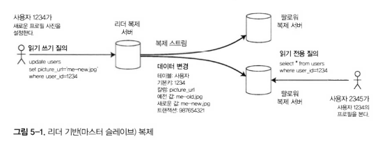

- 복제 서버(replica)
  - 데이터베이스의 복사본을 저장하는 각 노드를 의미
  - 모든 쓰기는 복제 서버에 적용되어야 한다.
    - 그렇지 않으면 복제 서버들은 동일한 데이터를 보장할 수 없기 때문
  - 다중 복제 서버를 적용하면 어떻게 모든 복제 서버에 데이터가 복제되었다는 것을 보장할까?에 대한 궁금증이 생긴다

- 리더 기반 복제(leader-based replication)
  - 능동 수동 복제(active-passive), 마스터 슬레이브(master-slave) 복제라고도 함
  - 복제 서버 중 하나를 leader(master or primary)로 지정
  - 클라이언트가 쓰기를 진행 시 리더에게만 요청
    - 리더는 로컬 저장소에 쓰기를 진행
    - 리더는 쓰기를 진행할 때마다 다른 복제 서버(follower or read replica, slave, secondary, hot standby)에 복제 로그(replication log)나 변경 스트림(change stream)을 전송
    - 팔로우들은 리더로부터 받은 로그를 통해 리더와 동일하게 모든 쓰기를 적용하여 동일한 데이터를 보장한다
  - 클라이언트는 읽기는 master, slave에게 질의할 수 있지만 쓰기는 master에게만 허용된다.

- 리더 기반 복제 사용
  - RDB에서 내장된 기능(PostgreSQL(9.0 부터), MySql, Oracle Data Guard 등)
  - NoSQL에서도 사용 가능(Mongo DB, Espresso, Rethink DB 등)
  - Message queue에서도 사용 가능(Kfaka, Rabbit MQ 등)
  - 네트워크 파일 시스템에서도 비슷하게 사용(DRBD)

### 🟢 동기식 대 비동기식 복제

- 복제 시스템의 세부사항
  - 복제를 동기식
  - 복제를 비동기식
  - RDB에서는 보통 설정이 가능한 옵션들
  - 그 외 시스템에서는 하드 코딩으로 진행
    
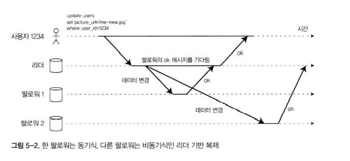
- 예시 설명
  - 클라이언트, 리더, 2개의 팔로워로 구성된 예제
  - 시간의 흐름은 왼쪽에서 오른쪽, 요청과 응답은 화살표

- 동기식
  - 팔로워1은 동기식
  - 리더와 일관성 있게 복제됨을 보장
  - 리더에 문제가 생기더라도 읽기는 팔로워1에서 진행되므로 계속 사용 가능
  - 단점
    - 팔로워1에 문제가 생기는 경우 쓰기가 처리가 안됨
    - 리더는 모든 쓰기를 차단하고 팔로워1이 복구될 때까지 기다려야 함
  - 이러한 단점으로 인해 모든 팔로워는 동기식으로 구성할 수 없음
    - 하나의 팔로워 장애로 모든 시스템이 멈춰야하기 때문
  
- 비동기식
  - 팔로워2는 비동기식
  - 보통 리더 기반 복제는 전부 비동기식으로 구성됨
    - 단점도 있지만 모든 팔로워가 잘못되더라도 리더가 살아있다면 쓰기와 읽기가 계속해서 진행 가능
  - 대부분의 시스템은 1초 이내에 적용됨
  - 단점
    - 무조건 빠르게 된다 or 복제된다는 보장은 없음
      - 장애를 복구중인 경우
      - 시스템 최대 가용량에 다다른 경우
      - 네트워크간 문제가 있는 경우

- 반동기식(semi-synchronous)
  - 1개의 동기식 팔로워 이 외에는 비동기식 팔로워로 구성
  - 만약 동기식 팔로워가 장애가 발생한다면 비동기식 팔로워중 1개를 동기식으로 변경하여 사용
    
### 🟢 새로운 팔로워 설정

- 새로운 팔로워를 등록하는데 발생하는 문제
  - 간단히 한 노드에 데이터를 다른 노드에 복사하는 것으로 해결할 수 없음
    - 클라이언트는 계속해서 데이터를 쓰고 있기 때문
  - 데이터베이스 전체를 락을 걸어서 쓰기를 불가능하게 만드는 방법으로도 해결할 수 없음
    - 고가용성 시스템 목표에 부합하지 않기 때문
- 중단 없이 팔로워를 추가하는 방법
  - 리더 데이터베이스의 스냅샷을 가져온다.
    - 대부분의 DB는 백업을 위해 이 기능을 갖추고 있다.
  - 스냅샷을 새로운 팔로워에 복사한다.
  - 팔로워는 리더에 연결해 스냅샷 이후에 발생한 모든 데이터 변경을 요청한다.
    - 스냅샷이 리더의 복제 로그와 정확한 위치와 연관되어야 한다.
    - PostgreSQL(log sequence number), MySQL(binlog coordinate)라고 한다.
  - 팔로워가 스냅샷 이후 데이터 변경의 비처리분(backlog)를 모두 처리한다.
    - 모두 따라잡았다고 말한다.
    - 이때부터 다른 팔로워와 동일한 프로세스를 처리한다.

### 🟢 노드 중단 처리

- 노드의 중단
  - 장애로 인한 중단
  - 계획된 유지보수로 인한 중단
- 리더 기반 복제에서 노드의 중단
  - 모든 시스템의 중단 없이 개별 노드별로 중단하고 재부팅할 수 있다는 것은 운영과 유지보수에서 큰 장점

_**팔로워 장애: 따라잡기 복구**_

- 팔로워의 복구
  - 팔로워의 복구는 간단하다.
  - 리더로부터 수신한 데이터 변경 로그를 로컬 디스크에 보관해둔다.
  - 보관된 로그에서 결함이 발생하기전 마지막으로 처리된 트랜잭션을 알아낸다.
  - 리더와 연결하여 연결이 끊어진 동안 발생된 데이터 변경을 모두 요청한다.
  - 리더를 모두 따라잡게되면 이전과 같은 프로세스가 진행된다.

_**리더 장애: 장애 복구**_
- 리더의 복구
  - 리더의 복구는 까다롭다.
  - 장애 복구(failover)를 진행한다.
    - 팔로워 중 하나를 새로운 리더로 승격시킨다.
    - 클라이언트는 새로운 리더로 쓰기를 전송하기 위해 재설정이 필요하다.
    - 다른 팔로워는 새로운 리더로부터 데이터를 변경에 대한 정보를 전달받는다.
  - 이러한 장애 복구는 자동과 수동이 있다.
  - 개발팀은 장애 복구 과정에서 잘못될 수 있는 것들 투성이라 수동으로 하는 것을 선호한다.

- 복구 과정
  - 리더가 장애가 발생하였는지 판단
    - 노드들 사이에서 서로 메세지를 주고 받으며 일정 시간 동안 노드가 응답하지 않으면 타임아웃된 것으로 간주한다.
    - 계획된 유지보수를 위해 의도적으로 중단하는 경우는 타임아웃을 적용하지 않는다.
  - 새로운 리더를 선택
    - 새로운 리더는 선출 과정 or 제어 노드(control node)에 의해 리더가 임명된다.
    - 새로운 리더는 보통 최신 데이터 변경사항을 모두 적용한 팔로워 노드이다.
  - 새로운 리더 사용을 위한 시스템 재설정 진행
    - 클라이언트는 새로운 쓰기 요청을 새로운 리더에게 보낸다.
    - 타임아웃되었던 리더가 복구된다면 리더가 아닌 팔로우로 인식되도록 해야한다. 

- 복구를 하며 발생할 수 있는 문제
  - 비동기식 복제에 대한 복구
    - 새로운 리더는 이전 리더가 장애가 발생하기 전 쓰기 일부를 수신하지 못할 수 있다.
    - 장애가 발생했던 리더가 팔로워로 돌아왔을 때 수신하지 못했던 데이터는 충돌이 발생한다.
    - 이러한 문제를 해결하는 가장 간단한 방법으로는 새로운 리더가 수신하지 못한 데이터를 삭제해버리는 것이다.
      - 이 부분은 클라이언트가 DB에 대한 내구성에 대한 기대를 저버리게 된다.
  - 깃허브 실제 사례
    - 데이터베이스와 외부 저장소 시스템이 내용을 공유하고 있던 상황이라면 특히 더 문제가 된다.
    - MySql 팔로워가 리더로 승격었는데 그 중 데이터 일부가 폐기처리한 경우에 문제가 발생했다.
      - 새로운 로우의 기본키를 할당하기 위해 자동 증가를 진행했다.
      - 새로운 리더는 수신하지 못한 데이터가 있었기에 이전 리더가 사용한 기본키값을 재사용하게 되었다.
      - 이 기본키는 레디스와도 공유되고 있었기에 MySql과 Redis 사이에 기본키 값이 불일치하게 되었다.
      - 결국 일부 사용자들은 개인데이터가 다른 사용자에게 공개되는 문제가 발생했다.
  - 스플릿 브레인(split brain)
    - 특정 결함에서는 2개의 노드 모두 자신이 리더라고 믿는 경우가 발생할 수 있다.
    - 2개의 리더가 모두 쓰기를 처리하는데 이 과정에서 쓰기가 발생하는 데이터에 대한 충돌이 발생한다.
      - 이로 인해 데이터가 유실되거나 오염된다.
    - 일부 시스템에서는 2개의 리더가 감지되면 하나의 노드를 종료하는 매커니즘을 사용한다.
      - 하지만 이 매커니즘도 잘 설계하지 않는다면 2개의 노드(리더)를 종료시켜버릴 수도 있다.
  - 적절한 타임아웃 기준
    - 너무 길면 리더가 오랜 시간동안 작동하지 않을 수 있다.
    - 너무 짧으면 불필요한 장애 복구 과정이 실행될 수 있다.
      - 네트워크 문제로 지연되어 리더가 장애가 발생하지 않았는데 복구 과정을 실행할 수 있다.
  
### 🟢 복제 로그 구현

리더 기반 복제는 내부적으로 어떻게 동작하는지에 대해 살펴보자.

_**구문 기반 복제**_

- 구문(statement) 기반 복제
  - 클라이언트가 요청한 쓰기를 기록한 이후 쓰기를 실핸하고 구문 로그를 팔로워에게 전달한다.
  - RDB는 모든 INSERT, UPDATE, DELETE 구문을 팔로워에게 전달하고 팔로워는 해당 SQL을 실핸한다.
  
- 구문 기반 복제가 깨질수 있는 사례
  - 현재 날짜와 시간을 얻기 위한 NOW()나 랜덤한 수를 얻기 위한 RAND()와 같은 비결정적 함수를 호출하는 것은 각 서버마다 달라질 수 있다.
  - 자동증가 컬럼을 사용하는 구문이나 데이터베이스에 있는 데이터에 의존하는 SQL은 정확히 같은 순서로 실행되어야 한다.
    - 예를 들어 `update ... where data < condition`인 경우 data와 condition의 값은 실행하려는 모든 노드가 같은 데이터를 복제하고 있어야 한다.
    - 동시에 여러 트랜잭션이 수행되는 것을 제한하게 한다.
  - 부수 효과를 가진 구문(트리거, 스토어 프로시저, 사용자 정의 함수)은 부수 효과가 완벽하게 결정적이지 않으면 서버별로 다른 부수효과가 발생할 수 있다.

- 사례들을 극복하기 위한 해결책
  - 리더는 구문을 기록할 때 모든 비결정적 함수 호출을 고정 값으로 반환하도록 처리한다.
    - 하지만 엣지 케이스가 있어 일반적으로는 다른 복제 방법을 선호한다.

- 구문 기반 복제 사용 사례
  - MySQL 5.1 이전까지는 구문 기반 복제를 사용했다. 
    - 하지만 현재는 기별정성이 있다면 로우 기반 복제(row-based replication)으로 변경해서 사용한다.
  - VoltDB는 구문 기반 복제를 사용한다.
    - 트랜잭션 처리시 구문이 결정적이 되게끔 요구하기 때문에 구문에 대한 안정성을 보장한다.

_**쓰기 전 로그 배송**_

- 데이터베이스는 일반적으로 로그 쓰기를 진행
  - 로그 구조 저장소에서 로그 자체가 저장소와 동일하게 주요한 부분
  - B트리에서는 모든 변경은 로그를 쓰고 나서 저장소에 반영 됨
- WAL(Write-Ahead Log Shipping)
  - 리더는 디스크에 로그를 기록하는 일 외에 팔로워에게 네트워크를 통해 전달하는 일도 담당
  - 팔로워는 전달 받은 로그를 처리하여 리더와 동일한 데이터를 만듦
  - postgeSQL, Oracle 에서 사용됨
- WAL 단점
  - 로그가 제일 저수준의 데이터로 기록됨
    - 데이터베이스에서 사용하는 저장소 version or 엔진이 달라진다면 데이터가 깨질 수 있음
  - 운영상 큰 영향이 있음
    - 팔로워가 리더보다 빠르게 신규 버전으로 업그레이드를 할때 복제 프로토콜 버전의 불일치를 허용하지 않기 때문에 시스템 중단시간이 필요함

_**논리적(로우 기반) 로그 복제**_

- 논리적 로그 복제
  - 복제와 저장소 엔진을 위한 다른 로그 형식을 사용함
    - 복제 로그를 저장소 엔진의 물리적 데이터와 구별하기 위한 논리적 로그를 사용함
  - RDB의 로그의 종류
    - 삽입된 로우의 로그는 모든 컬럼의 새로운 값이다
    - 삭제된 로우의 로그는 고유 식별값 정보를 포함한다.
    - 수정된 로우의 로그는 고유 식별값 정보와 새로운 값을 포함한다.
- 장점
  - 저장소 엔진 내부와 분리되어 호환성이 높음
  - 리더/팔로워 간 DB 버전이 달라도 사용 가능
  - 심지어 다른 저장소 엔진 간에도 적용 가능
- 변경 데이터 캡처(change data capture, CDC)
  - 외부 시스템에 데이터베이스의 내용을 전송하는 기술

_**트리거 기반 복제**_

- 트리거 기반 복제
  - 기존 복제 방식은 DB 시스템에 의해 수행되지만, 트리거 기반 복제는 애플리케이션 코드 수준에서 구현
  - 서로 다른 종류의 데이터베이스 간 복제나 추가적 처리 로직이 필요한 경우 활용
  - 오라클 Databus, PostgreSQL용 부카르도(Bucardo)에서 사용

- 동작 원리
  - 데이터베이스 내에서 데이터 변경(쓰기 트랜잭션)이 발생하면 자동 실행
  - 트리거는 변경 내용을 별도 테이블에 기록 → 외부 프로세스가 이를 읽어 필요한 로직을 적용 → 다른 시스템으로 복제

- 단점
  - 다른 복제 방식보다 오버헤드가 큼
  - 데이터베이스 자체적으로 내장된 복제보다 버그나 제한 사항이 더 많이 발생함
  - 그럼에도 사용하는 이유는 유연성 때문에 
  
## 🟠 복제 지연 문제

- 리더 기반 복제
  - 모든 쓰기는 리더를 거쳐야 하지만 읽기는 복제 서버(팔로워)에서도 가능
  - 읽기 요청이 많고 쓰기 비율이 낮은 대부분의 웹 애플리케이션 패턴에 적합
  - 다수 팔로워를 추가해 읽기 확장(read-scaling) 가능

- 동기 vs 비동기 복제
  - 동기식제: 모든 팔로워에 반영될 때까지 대기 → 안정적이지만 네트워크/노드 장애 시 전체 시스템 쓰기 불가
  - 비동기식 복제: 대부분 시스템에서 사용, 팔로워가 리더보다 뒤처질 수 있음
    - 팔로워에서 읽으면 과거 데이터 볼 가능성 → 불일치 발생
    - 하지만 시간이 지나면 리더와 동기화 → 최종적 일관성(eventual consistency) 적용

- 복제 지연
  - 리더에서 발생한 쓰기가 팔로워에 반영되기까지의 지연
  - 정상적 상황에서는 매우 짧은 시간
  - 하지만 근처에서 동작하거나 네트워크 문제가 있을 경우 몇 초 이상 지연될 수 있음
  - 이번 장에서는 복제 지연을 해결하기 위한 방법에 대해 설명한다.

### 🟢 자신이 쓴 내용 읽기

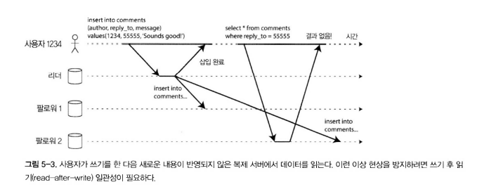

- 비동기식 복제에 문제
  - 많은 애플리케이션은 사용자가 제출한 데이터를 즉시 자신에게 보여줘야 함
  - 예: 댓글, 토론 글 작성 후 바로 확인
  - 리더에 데이터가 쓰여도 읽기는 팔로워에서 수행 → 비동기 복제 시 지연 발생 가능
  - 사용자가 본인이 제출한 데이터가 유실된 것처럼 보이면 불만족스러움 발생
  - 쓰기 후 읽기 일관성 필요
  - 자신이 쓴 데이터는 항상 볼 수 있어야 함

- 구현 방법
  - 사용자가 쓴 데이터는 리더에서 읽게 강제
    - 프로필 수정 같은 경우 항상 리더에서 읽도록 설정
  - 애플리케이션에서 시간 기반 접근
    - 사용자가 데이터를 쓴 후 일정 시간 동안은 리더에서만 읽도록 설정
  - 최근 쓰기 타임스탬프 확인
    - 사용자가 마지막으로 쓴 시점을 기록해두고, 그 이후 데이터는 리더에서 읽기
  - 팔로워 지연 모니터링
    - 팔로워의 복제 지연이 일정 기준 이하일 때만 읽기 요청을 허용

- 다바이스 간 문제 (Cross-device)
  - 동일 사용자가 여러 기기(PC, 모바일 등)에서 접근할 경우, 쓰기 후 읽기 일관성이 더 복잡해짐
  - 해결 방안
    - 중앙집중식 세션 관리 및 타임스탬프 공유
    - 여러 데이터센터 간 복제 시 동일 데이터센터로 라우팅 필요

### 🟢 단조 읽기

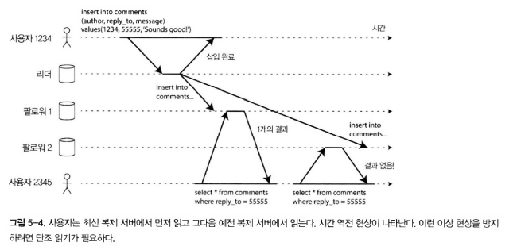

- 시간 역행 현상
  - 비동기식 복제에서 발생할 수 있는 현상
  - 사용자가 여러 복제 서버에서 읽기를 수행할 때, 이전에는 보였던 데이터가 다시 보이지 않는 문제가 생김
  - 예: 새 댓글이 추가된 후 첫 번째 읽기에서는 보였지만, 두 번째 읽기에서 다른 복제 서버가 아직 반영하지 않아 댓글이 사라져 보이는 상황

- 단조 읽기 보장
  - 한 사용자가 여러 번 읽을 때 시간이 거꾸로 흐르지 않도록 보장
  - 즉, 새로운 데이터를 본 이후에는 그 이전 상태의 데이터를 다시 보지 않음

- 구현 방법
  - 같은 사용자의 모든 읽기를 항상 동일한 복제 서버에서 수행되도록 함
  - 예: 사용자 ID의 해시값을 기준으로 특정 복제 서버에 매핑
  - 단, 복제 서버 장애 발생 시 다른 서버로 재라우팅 필요

### 🟢 일관된 순서로 읽기

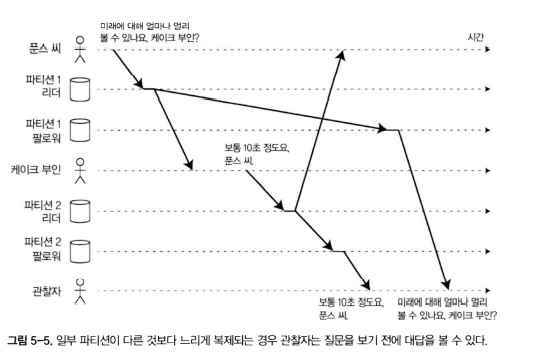

- 인과성
  - 아래와 같이 정상적인 대화 흐름이 인과성이 있다라고 한다.
    ```text
    푼스 씨
    미래에 대해 얼마나 멀리 볼 수 있나요. 케이크 부인?
    
    케이크 부인
    보통 10초 정도요. 푼스 씨.
    ``` 
  - 인과성 위반 대화
    ```text
    케이크 부인
    보통 10초 정도요. 푼스 씨.
    
    푼스 씨
    미래에 대해 얼마나 멀리 볼 수 있나요. 케이크 부인?
    ``` 

- 인과성 위반
  - 사용자가 대화를 읽을 때, 질문보다 답변이 먼저 보이는 등 시간 순서가 뒤집혀 보이는 현상 발생
  - 예: 팔로워에서 질문(늦게 복제됨)보다 답변(먼저 복제됨)이 먼저 도착해 대화 흐름이 왜곡됨

- 일관된 순서로 읽기 보장
  - 쓰기가 특정 순서로 발생하면, 모든 사용자가 해당 순서 그대로 읽도록 보장
  - 즉, 쓰기의 인과 관계가 뒤집혀 보이지 않음
  - 강력한 일관성은 아니지만, 대화·타임라인 등 인과성이 중요한 애플리케이션에서 필수적

- 발생
  - 파티셔닝(샤딩)된 데이터베이스에서만 발생하는 문제
  - 자세한 내용은 6장에서 설명한다.

### 🟢 복제 지연을 위한 해결책

- 문제 인식
  - 최종적 일관성 시스템에서 복제 지연이 수 분~수 시간까지 늘어나면 사용자 경험이 나빠짐
  - 따라서 쓰기 후 읽기 같은 강한 보장을 제공하는 시스템 설계가 필요
  - 실제로는 비동기 복제에 동기적 보장을 덧붙이는 식으로 해결하지만 해결책이 아님

- 트랜잭션의 역할
  - 개발자가 복제 문제를 신경 쓰지 않고도 올바른 작업 수행을 보장
  - 트랜잭션은 DB가 강력한 보장을 제공하는 핵심 수단
  - 단순함을 유지하면서도 신뢰성 있는 데이터 처리 보장
  - 단일 노드에서는 적용이 되지만 분산 데이터베이스로 전환하는 과정에서 많은 시스템이 트랜잭션을 포기함
  - 트랜잭션 포기는 성능과 확장성 때문에 이루어진 경우가 많음
  - 하지만 현대 시스템에서는 트랜잭션 보장이 여전히 중요
  - 7장과 9장에서 트랜잭션에 대해 다시 다룰 예정

## 🟠 다중 리더 복제

- 단일 리더 기반 복제
  - 기존까지는 단일 리더 기반 복제 아키텍처를 고려
  - 단일 리더 방식은 일반적이지만 한계가 있음
  - 리더에 연결할 수 없으면(네트워크 장애 등) 쓰기 불가

- 다중 리더 복제 개념
  - 쓰기를 허용하는 노드를 여러 개 두는 방식
  - 각 리더는 자신의 쓰기를 처리하고, 변경 내용을 다른 모든 리더 노드에 전파
  - 각 리더는 동시에 다른 리더의 팔로워 역할도 수행
  - "마스터-마스터 복제" 또는 "액티브-액티브 복제"라고도 부름

### 🟢 다중 리더 복제의 사용 사례

다중 리더 설정은 추가되는 복잡도에 비해 이점이 크지 않다. 하지만 몇 가지 상황에서는 필요하기에 이번장에서 내용을 설명한다.

_**다중 데이터센터 운영**_

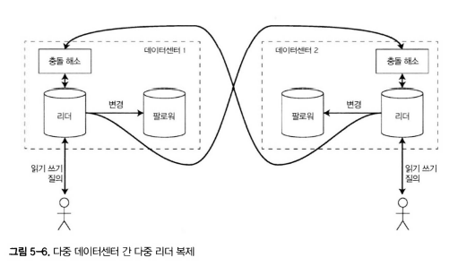

- 단일 리더 복제와 다중 리더 복제
  - 단일 리더 설정: 하나의 데이터센터만 리더를 보유, 모든 쓰기가 그곳을 거침
  - 다중 리더 설정: 각 데이터센터에 리더를 두고 서로 변경 사항을 복제

- 단일 리더 vs 다중 리더 비교
  - 성능
    - 단일 리더: 모든 쓰기를 인터넷을 통해 리더 데이터센터로 보내야 하므로 지연 증가
    - 다중 리더: 로컬 데이터센터에서 쓰기를 처리 후 다른 데이터센터로 비동기 복제 → 사용자 경험 개선
  - 데이터센터 중단 내성
    - 단일 리더: 리더 장애 시 다른 데이터센터가 리더로 승격 필요
    - 다중 리더: 각 데이터센터가 독립적으로 운영되므로 장애 시에도 쓰기 지속 가능
  - 네트워크 문제 내성
    - 단일 리더: 네트워크 문제 시 쓰기 중단 위험
    - 다중 리더: 로컬 쓰기는 계속 가능, 이후 동기화 진행
  - 다중 리더 사용
    - MySQL: Tungsten Replicator
    - PostgreSQL: BDR
    - Oracle: GoldenGate

- 장점
  - 성능 향상, 고가용성, 로컬 쓰기 가능
  - 장애 및 네트워크 문제 발생 시에도 시스템 지속 운영 가능

- 단점
  - 동일 데이터가 여러 데이터센터에서 동시에 변경될 수 있어 충돌 발생 위험
  - 설정상 실수나 다른 데이터베이스와 충돌 문제가 있다. (예: 자동 증가 키, 트리거, 제약 조건 등에서 문제 심각)
  - 이러한 이유로 다중 리더 복제는 가능하면 피해야하는 영역으로 간주 된다.


_**오프라인 작업을 하는 클라이언트**_

- 오프라인 작업을 하는 클라이언트
  - 인터넷 연결이 끊겨도 애플리케이션이 동작해야 하는 경우
  - 예: 휴대전화, 노트북, 기타 디바이스의 캘린더 앱

- 동작 방식
  - 디바이스는 인터넷 연결 여부와 관계없이 회의 일정을 읽거나 추가 가능 (읽기/쓰기 요청)
  - 오프라인 상태에서 변경된 데이터는 나중에 온라인 상태가 되면 다른 디바이스와 동기화

- 구현 구조
  - 각 디바이스가 로컬 DB에 리더처럼 동작하며 데이터 저장
  - 디바이스 간 데이터 변경은 다중 리더 복제를 통해 비동기적으로 전파
  - 사용자가 다시 인터넷에 연결되면 수 분~수 시간 내에 데이터가 동기화

- 특징
  - 아키텍처적으로 데이터센터 간 다중 리더 복제와 동일
  - 디바이스 간 네트워크 연결은 신뢰성이 낮아 깨진 연결 복구가 오래 걸림
  - 따라서 다중 리더 복제는 오프라인/온라인 전환이 잦은 환경에 적합
  - 카우치DB(CouchDB)가 다중 리더 복제를 손쉽게 설정할 수 있도록 설계된 DB

_**협업 편집**_

- 협업 편집
  - 여러 사용자가 동시에 문서를 편집할 수 있는 애플리케이션
  - 예: 이더패드(Etherpad), 구글 독스(Google Docs)

- 기본 방식
  - 한 사용자가 문서를 편집하면 변경 내용이 즉시 로컬 복제본에 반영
  - 이후 동일한 문서를 복제 중인 다른 사용자/서버에도 비동기 방식으로 전파

- 문제점
  - 단순한 방법은 문서에 잠금(lock) 을 걸어 한 번에 한 사용자만 편집 가능하게 하는 것
  - 단순하지만 다른 사용자는 락이 해제될때까지 작업을 대기해야 함

- 개선된 방식
  - 빠른 협업을 위해 문서를 작게 분할(예: 단일 키 입력 단위) 하여 충돌 가능성을 줄임
  - 여러 사용자가 동시에 편집할 수 있도록 하고, 충돌 해결 알고리즘 필요
  - 이 방식은 다중 리더 복제에서 발생하는 모든 문제(충돌 포함)를 야기한다.
  
### 🟢 쓰기 충돌 다루기


다중 리더 복제에서 제일 큰 문제는 쓰기 충돌이 발생한다는 것. 즉 쓰기 충돌을 해결해야한다.

예시처럼 사용자1이 A->B, 사용자2가 A->C로 변경했을 경우 로컬 리더에 정상 처리되지만 복제할때 충돌을 감지한다. 

_**동기 대 비동기 충돌 감지**_

- 단일 리더 복제와 다중 리더 복제의 충돌 감지
  - 단일 리더 복제
    - 첫 번째 쓰기가 끝날 때까지 두 번째 쓰기를 차단
    - 트랜잭션을 직렬화해 충돌을 원천적으로 방지
  - 다중 리더 복제
    - 두 쓰기가 모두 성공할 수 있음
    - 충돌은 나중에 비동기적으로 감지 → 사용자에게 너무 늦게 알려질 수 있음

- 동기적 충돌 감지
  - 쓰기가 성공했다고 알리기 전에 모든 복제 서버에 복제 완료를 기다림
  - 하지만 이 경우, 다중 리더 복제의 장점(여러 서버가 독립적으로 쓰기 처리)을 잃음
  - 충돌을 동기적으로 감지하려면 사실상 단일 리더 복제와 유사하게 동작해야 함

_**충돌 회피**_

- 충돌 회피
  - 충돌을 처리하는 가장 단순한 방법
  - 특정 레코드의 모든 쓰기를 동일한 리더로 보내도록 애플리케이션에서 강제
  - 이 경우 충돌이 발생하지 않음

- 예시
  - 사용자가 자신의 데이터를 편집하는 애플리케이션 → 항상 동일한 데이터센터/리더에서 요청 처리
  - 다른 사용자는 다른 “홈 데이터센터”를 가지지만, 각 사용자 입장에서는 단일 리더 구조처럼 동작

- 한계
  - 데이터센터 장애 시: 다른 데이터센터로 트래픽을 라우팅해야 함
  - 이 과정에서 리더가 변경되면 충돌 회피가 깨질 수 있음
  - 따라서 리더 변경 시 동시 기록 가능성에 대비해야 함

_**일관된 상태 수렴**_

- 단일 리더 DB
  - 순차적 쓰기 적용 → 동일 필드를 여러 번 갱신하면 마지막 쓰기가 최종 값

- 다중 리더 DB 문제
  - 쓰기 순서가 정해지지 않아 최종 값이 불명확
  - 예: 리더1이 제목을 "B"로, 리더2가 "C"로 갱신하면 결과 충돌 발생
  - 순서를 강제할 수 없으므로 수렴(convergent) 방식으로 충돌 해결 필요

- 수렴의 의미
  - 모든 복제본이 동일한 최종 값에 도달해야 함
  - 복제 서버 간 일관성 유지

- 충돌 해결 방법들
  - 승자 결정 방식
    - 각 쓰기에 타임스탬프, 길이, UUID 등 메타데이터 부여 → 가장 높은 값이 승자
    - 대표 방식: 최종 쓰기 승리(Last Write Wins, LWW)
    - 단점: 데이터 유실 위험 존재
  - 서버 ID 기반 우선순위
    - 각 서버에 고유 ID를 부여, 숫자가 높은 서버의 쓰기를 우선
    - 단점: 데이터 유실 가능
  - 값 병합
    - 사전 정의된 규칙으로 여러 값 병합
    - 예: 제목 충돌 시 "B/C"처럼 결합
  - 명시적 충돌 기록
    - 충돌된 데이터를 모두 저장
    - 나중에 사용자에게 보여주고 애플리케이션 코드에서 충돌 해소

_**사용자 정의 충돌 해소 로직**_

- 개념
  - 충돌을 해결하는 방식은 애플리케이션마다 다름
  - 따라서 다중 리더 복제 도구들은 애플리케이션 코드로 충돌 해소 로직을 작성하도록 지원
  - 해당 코드는 쓰기 또는 읽기 시점에 실행됨

- 쓰기 수행 중 해소
  - 데이터베이스 시스템이 충돌을 감지 → 즉시 핸들러 실행
  - 예: Bucardo(복제 도구) → 충돌 발생 시 미리 작성된 코드 실행
  - 보통 사용자에게 충돌을 직접 노출하지 않고 백그라운드에서 처리

- 읽기 수행 중 해소
  - 충돌된 모든 쓰기를 저장 → 이후 데이터 읽을 때 애플리케이션이 충돌 처리
  - 사용자에게 여러 버전 데이터를 보여주고 선택하도록 할 수도 있음
  - 예: CouchDB → 충돌된 데이터 버전을 모두 저장, 애플리케이션이 해소

- 적용 단위
  - 충돌 해소는 보통 **전체 트랜잭션이 아니라 개별 로우나 문서 수준**에서 이루어짐
  - 따라서 같은 트랜잭션 내 다른 쓰기에는 영향을 미치지 않음

_**자동 충돌 해소**_

- 자동 충돌 해소란
  - 충돌 해소 규칙을 자동화하면 빠르고 복잡하지 않게 처리 가능
  - 맞춤형 코드는 오류 가능성이 높지만, 자동 해소는 단순화된 로직으로 안정성 제공
  - 예: 아마존 장바구니
    - 추가된 상품은 보존
    - 삭제된 상품은 보존하지 않음
    - 따라서 예전에 삭제된 상품이 다시 장바구니에 보일 수도 있음

- 연구 및 접근 방식
  - 충돌 없는 복제 데이터 타입 (CRDT)
    - set, map, 정렬 목록, 카운터 등 분산 데이터 구조
    - 여러 사용자가 동시에 수정해도 충돌을 자동으로 합리적으로 해소
    - 예: Riak DB 일부 구현

  - 병합 가능한 영속 데이터 구조
    - Git 버전 관리 시스템과 유사
    - 명시적으로 변경 히스토리를 추적 후, 삼중 병합 함수(three-way merge) 사용
    - CRDT는 이중 병합(two-way merge)을 사용하는 차이 존재

  - 운영 변환 (Operational Transformation, OT)
    - 협업 편집 시스템(Etherpad, Google Docs 등)에서 충돌 해소에 사용
    - 특히 텍스트 문서 편집 시 삽입·삭제 충돌을 자연스럽게 처리

- 한계 및 전망
  - 충돌 회피/해소 알고리즘은 아직 성숙 단계 아님
  - 하지만 앞으로 복제 DB 시스템에 점점 더 통합될 가능성이 높음
  - 자동 충돌 해소는 애플리케이션이 다중 리더 데이터 동기화를 쉽게 구현할 수 있게 만듦

_**충돌은 무엇인가?**_

- 충돌은 무엇인가
  - 동일한 레코드의 동일한 필드를 동시에 서로 다른 값으로 수정할 때 발생
  - 예: 두 번째 쓰기가 같은 필드를 각각 다른 값으로 갱신

- 단순한 경우
  - 명확히 충돌로 판별 가능 (예: 동일 필드의 값이 다르게 갱신됨)

- 복잡한 경우
  - 회의실 예약 시스템 예시
    - 한 회의실은 특정 시간에 하나의 예약만 가능해야 함
    - 같은 시간에 동일 회의실을 두 명이 예약 → 충돌 발생
  - 7장에서 충돌 예제를 더 살펴보고 12장에서 복제 시스템 충돌을 감지하고 해소하는 방법에 대해 알아보자.

### 🟢 다중 리더 복제 토폴로지

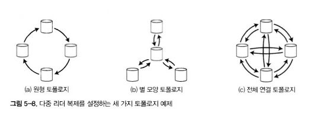

- 복제 토폴로지
  - 쓰기를 한 노드에서 다른 노드로 전달하는 통신 경로
  - 리더가 2개일 경우: 리더1의 쓰기는 리더2로, 리더2의 쓰기는 리더1로 전달 → 토폴로지는 1가지뿐
  - 리더가 3개 이상일 경우: 다양한 토폴로지가 가능

- 대표적인 토폴로지
  - 전체 연결 (all-to-all)
    - 모든 리더가 각자의 쓰기를 모든 다른 리더에 전달
  - 원형 (circular topology)
    - 각 노드가 다음 노드에만 쓰기를 전달
    - MySQL 기본 방식
  - 별 모양 (star topology)
    - 지정된 루트 노드가 모든 다른 노드로 쓰기를 전달

- 토폴로지별 특징
  - 원형/별 모양: 단일 노드 장애 시 전체 복제에 지연 발생
  - 전체 연결: 신뢰성은 높지만 네트워크 혼잡 시 메시지 누락 위험
  


- 문제 상황 (그림 5-9 예시)
  - 클라이언트 A → 리더1에 삽입, 클라이언트 B → 리더3에서 갱신
  - 리더2는 다른 순서로 쓰기를 받아 삽입 이전에 갱신이 반영되는 문제 발생
  
- 원인
  - 갱신은 삽입에 종속적이므로 모든 노드에서 삽입 후 갱신 순서가 지켜져야 함
  - 단순 타임스탬프만으로는 해결 불가

- 해결 방법 
  - 버전 벡터 (version vector)
  - 이벤트의 인과 관계를 명시적으로 추적
  - 올바른 실행 순서를 보장하는 데 사용됨

## 🟠 리더 없는 복제

- 기존 복제 방식의 특징
  - 단일 리더 / 다중 리더 모델은 클라이언트의 쓰기 요청을 리더가 받아 순서를 정한 뒤 팔로워에 복제

- 리더 없는 복제의 개념
  - 리더 개념을 버리고 모든 복제 서버가 클라이언트로부터 직접 쓰기를 받을 수 있음
  - 특정 서버가 리더 역할을 전담하지 않음

- 사용 사례
  - 초기 분산 데이터베이스 시스템은 대부분 리더 기반 모델을 사용했음
  - 리더 없는 복제는 아마존 Dynamo 시스템에서 사용한 후 유행함
  - 대표적인 오픈소스 예시: **Cassandra, Riak, Voldemort**

- 동작 방식
  - 클라이언트가 여러 복제 서버에 직접 쓰기를 전송
  - 코디네이터 노드(coordinator node)가 클라이언트를 대신해 여러 서버에 쓰기 요청
  - 특정 서버가 리더처럼 순서를 강제하지 않음
  
### 🟢 노드가 다운됐을 때 데이터베이스에 쓰기

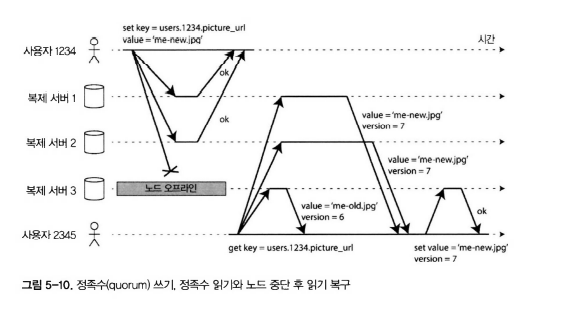

- 리더 기반 복제와 차이
  - 리더 기반 복제에서는 쓰기 처리를 계속하려면 장애 복구(failover)가 필요
  - 리더 없는 복제에서는 장애 복구가 필요하지 않음

- 예시
  - 사용자 A가 쓰기를 하면 요청이 모든 복제 서버로 병렬 전송
  - 일부 복제 서버가 다운되면 쓰기를 받지 못하지만, 일정 수의 복제 서버가 쓰기를 확인하면 성공으로 간주
  - 특정 복제 서버에 쓰기가 누락되더다로 시스템은 동작

- 문제
  - 다운된 노드가 다시 온라인 상태가 되면, 그동안 발생한 쓰기를 반영하지 못했기 때문에 오래된(outdated) 값을 가질 수 있음
  - 이때 클라이언트가 해당 노드에서 읽으면 잘못된 값을 반환할 가능성 있음

- 해결 방법
  - 클라이언트는 읽기 요청을 여러 노드에 병렬 전송
  - 서로 다른 응답을 받을 경우 버전 번호 등을 비교하여 최신 값을 결정
  - 이를 통해 오래된 값을 읽을 위험을 줄임

_**읽기 복구와 안티 엔트로피**_

- 복제 계획의 목표
  - 최종적으로 모든 데이터가 모든 복제 서버에 복사된 상태를 보장해야 함
  - 문제: 다운된 노드가 복구된 후 누락된 쓰기를 어떻게 따라잡을 것인가?

- 읽기 복구
  - 클라이언트가 여러 노드에 병렬로 읽기 요청 → 오래된 응답을 감지 가능
  - 동일 데이터를 읽었을 때 일부 서버는 최신 값, 일부는 오래된 값 반환
  - 클라이언트는 오래된 값을 알 수 있고 최신 값으로 다시 기록 → 최신 상태 유지
  - 읽기 요청 시점에만 수행, 읽지 않는 데이터는 복구되지 않음

- 안티 엔트로피 처리
  - 백그라운드 프로세스를 통해 복제 서버 간 데이터를 지속적으로 비교·동기화
  - 누락된 데이터를 다른 서버로 복사 → 모든 서버가 일관된 데이터 유지
  - 읽기와 관계없이 수행, 따라서 잘 읽히지 않는 데이터도 동기화 가능
  - 다이나모 계열 시스템에서 주로 사용

_**읽기와 쓰기를 위한 정족수**_

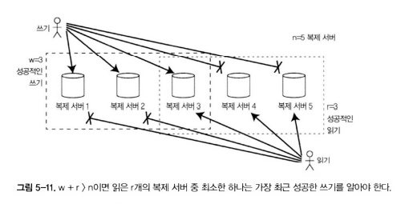

- 문제 상황
  - 복제 서버가 여러 개 있을 때 일부 서버만 성공해도 쓰기/읽기를 성공으로 볼 수 있는가?
  - 어느 범위까지 허용해야 최신성과 안전성을 유지할 수 있는가?

- 정족수(quorum) 개념
  - `n` = 복제 서버 수
  - `w` = 쓰기 성공에 필요한 최소 응답 수
  - `r` = 읽기 성공에 필요한 최소 응답 수
  - 조건: `w + r > n` 이면 항상 최신 데이터 읽기 보장

- 동작 방식
  - 모든 서버에 요청을 보내지만,
    - 쓰기: 최소 `w`개의 응답 확인 시 성공
    - 읽기: 최소 `r`개의 응답 확인 시 성공
  - 예시
    - `n=3, w=2, r=2` → 읽기와 쓰기가 겹치는 서버가 반드시 존재, 최신 값 확보
    - `n=5, w=3, r=3` → 읽기 시 최소 3개 서버 확인해 최신성 유지
  - 일부 서버 장애나 지연이 있어도 작업 가능

- 장점
  - 고장이나 네트워크 분할 상황에서도 최신 값 확보 가능
  - `w`, `r` 값을 조정해 성능과 일관성 사이 균형 조절 가능

- 한계
  - `w + r ≤ n` 인 경우 오래된 값 반환 가능
  - 과반수 이상의 서버 실패 시 데이터 손실 위험 존재

### 🟢 정족수 일관성의 한계

- 기본 아이디어
  - 복제 서버가 `n`개 있고, 쓰기 성공 노드 수를 `w`, 읽기 성공 노드 수를 `r`라 할 때
  - 일반적으로 `w + r > n`이면 읽기는 항상 최신 값을 반환한다고 기대됨
  - 이유: 읽기와 쓰기 노드 집합이 겹치므로 최소 하나 이상의 최신 값을 가진 노드가 읽기에 포함됨

- 일반적인 선택
  - 보통 `r`과 `w`를 각각 `n/2` 초과로 설정
  - 이 경우 `n/2` 노드 장애가 발생해도 `w + r > n`이 유지됨
  - 하지만 항상 다수 노드가 필요하지는 않음 → 읽기·쓰기 동작에 최소 하나씩만 겹치면 되기 때문
  - 분산 시스템에서는 성능과 유연성을 위해 `r`과 `w`를 다르게 설정하기도 함

- 유연한 조정
  - 경우에 따라 `w + r <= n`으로 설정할 수도 있음
  - 이때는 모든 읽기·쓰기 요청을 `n`개 노드에 전송하더라도 최신 응답을 못 받을 수 있음
  - 예: `w`가 작으면 오래된 값이 반환될 가능성이 높음 → 쓰기 속도는 빠르지만 최신성 보장은 약해짐

- 실패 상황에서의 문제
  - 쓰기 지연 → 일부 복제 서버 반영 실패 → 오래된 값 반환 가능
  - 두 개 쓰기 동시 발생 → 순서가 어긋나 동기화 지연
  - 쓰기와 읽기 지연이 동시에 발생 → 일부 복제 서버 불일치 상태 발생
  - 네트워크 장애, 디스크 장애 등으로 인해 서로 다른 노드에서 서로 다른 값이 반환될 수도 있음

- 실무적 한계
  - 정족수가 항상 최신 쓰기를 반환한다고 보장할 수 없음
  - 다이나모 스타일 시스템은 최종적 일관성(eventual consistency)을 목표로 함
  - 따라서 응용 상황에 따라 `r`, `w` 값 조정 → 일관성, 지연시간, 내구성 간 균형 맞춤 필요

- 관련 주제
  - 복제 지연 문제 (자신이 쓴 내용 읽기, 단조 읽기, 일관된 순서 읽기)와 밀접한 관련
  - 이후 장(7장, 8장)에서 더 심화된 트랜잭션과 일관성 주제로 이어짐

_**최신성 모니터링**_

- 최신성 모니터링이란
  - 데이터베이스가 항상 최신 결과를 반환하는지 모니터링하는 것은 운영 관점에서 매우 중요
  - 오래된 값 반환 허용 시에도, 그 원인을 추적하고 알릴 수 있어야 함  
    (예: 네트워크 문제, 과부하 노드 등)

- 리더 기반 복제의 경우
  - 리더는 쓰기가 적용된 순서를 알고 있어 복제 지연을 지표로 노출 가능
  - 모니터링 시스템은 이 지표를 활용해 팔로워가 리더에 얼마나 뒤처져 있는지 측정
  - 복제 로그 위치 차이, 적용된 쓰기 수 등을 기반으로 복제 지연 파악 가능

- 리더 없는 복제의 경우
  - 쓰기 순서를 고정하기 어렵기 때문에 모니터링 난이도가 증가한다.
  - 읽기 복구나 안티 엔트로피가 없으면, 얼마나 오래된 값이 반환될지 예측 불가
  - 따라서 모니터링 지표만으로는 신뢰하기 어려움

- 측정 방법
  - 리더 없는 복제 시스템에서는 복제 서버의 오래됨(staleness) 정도를 측정하는 연구 존재
  - 매개변수 `n, w, r`에 따라 오래된 값 반환 비율 계산 가능
  - 유즈케이스별 지표를 설계해 운영 관리에 반영하는 것이 권장됨

- 운영적 함의
  - 최종적 일관성은 의도적으로 모호한 보장임
  - 따라서 실제 운영에서는 얼마나 최종적인가?를 수치적으로 측정·관리해야 안정성 확보 가능
  
### 🟢 느슨한 정족수와 암시된 핸드오프

- 특징
  - 적절히 설정된 정족수 시스템은 개별 노드 장애 시 복구 없이도 동작 가능
  - 모든 `n`개 노드 응답을 기다리지 않고 일부 응답만으로도 읽기/쓰기 처리 가능
  - 단점: 낮은 일관성 

- 한계
  - 기존 정족수는 내결함성이 없음
    - 네트워크 장애 시 일부 노드에만 접근 가능할 수 있음
    - 이 경우 `w + r > n` 조건이 유지되지 않음
  - 따라서 일부 요청은 오류 반환해야 하나, 현실적 시스템에서는 완화된 접근 필요

- 느슨한 정족수
  - 지정된 `n`개 노드가 아닌, 접근 가능한 다른 노드에 임시로 요청 위임
  - 네트워크 장애 상황이 해재되면 한 노드가 다른 노드를 위해 일시적으로 수용한 모든 쓰기를 해당 홈노드로 전송한다. 이 방식을 암시된 핸드오프 (Hinted Handoff)라 한다.

- 장점
  - 쓰기 가용성 크게 향상된다.
  - 노드 일부가 장애 상태여도 시스템이 지속적으로 동작 가능

- 단점
  - `w + r > n` 조건에서도 항상 최신 값을 보장하지 않음
  - 데이터가 임시 노드에만 저장될 수 있어, 원래 노드 복구 전까지는 완전한 내구성 없음

- 실제 적용
  - 다이나모(Dynamo) 계열 시스템에서 자주 활용
  - 리악(Riak), 카산드라(Cassandra), 볼드모트(Voldemort) 등에서 기본적으로 사용됨
  - 선택적 기능으로 구현되며, 시스템에 따라 활성화 여부 다름

_**다중 데이터센터 운영**_

- 다중 데이터센터 운영에 적합
  - 다중 리더 복제와 리더 없는 복제는 데이터센터 간 복제에도 적합
  - 동시 쓰기 충돌, 네트워크 중단, 지연 시간 증가를 허용할 수 있기 때문
- 사례
  - 카산드라와 봁드모트는 일반적인 리더 없는 모델에 다중 데이터센터 지원을 구현
  - 리더 없는 모델 기반으로 다중 데이터센터 지원
  - `n`개의 복제 서버를 모든 데이터센터에 분산 가능
  - 각 데이터센터별로 몇 개의 복제 서버를 둘지 설정 가능
  - 클라이언트 요청은 모든 복제 서버에 전송되지만, 보통은 **로컬 데이터센터 내 정족수 응답**만 기다림
  - 이 방식으로 지연 시간과 네트워크 장애 영향을 줄임

- 리악(Riak)
  - 클라이언트와 데이터베이스 간 연결은 항상 하나의 데이터센터 로컬에서 수행
  - `n`은 하나의 데이터센터 내부의 복제 서버 수로 정의됨
  - 데이터센터 간 복제는 백그라운드에서 비동기로 처리
  - 방식적으로는 다중 리더 복제와 유사
  
### 🟢 동시 쓰기 감지

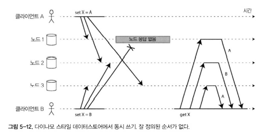

- 문제 상황
  - 다이나모 스타일 데이터베이스는 여러 클라이언트가 같은 키에 동시에 쓰기를 허용하기 때문에 엄격한 정족수를 사용하더라도 충돌 발생한다.
  - 충돌은 다중 리더 복제, 읽기 복구, 암시된 핸드오프 중에도 발생할 수 있음
  - 네트워크 지연과 장애로 인해 이벤트가 노드에 도달하는 순서가 달라질 수 있음

- 예시
  - 클라이언트 A는 `X=A`, 클라이언트 B는 `X=B`를 동시에 기록
  - 노드1: A만 받고 B는 놓침
  - 노드2: A 먼저 받고, 그 뒤 B 기록
  - 노드3: B 먼저 받고, 그 뒤 A 기록
  - 결국 각 노드가 서로 다른 순서와 결과를 가짐
  - 읽기 요청 시 일관성 깨짐
  - 어떤 노드는 `X=A`를 최종값이라 판단, 다른 노드는 `X=B`를 최종값으로 인식

- 최종적인 일관성을 달성하기 위해 어떻게 해야할까?
  - 최종적 일관성을 위해 모든 복제본이 동일한 값으로 합의해야 함
  - 데이터베이스가 이를 자동으로 처리하면 좋지만, 대부분 구현은 개발자가 충돌 처리 방식을 이해하고 설계해야 함

_**최종 쓰기 승리(동시 쓰기 버리기)**_

- 문제 상황
  - 복제본의 값을 통일하기 위한 방법 중 하나는 최신값을 선택하는 것
  - 어떤 쓰기가 최신인지 명확히 알 수 없는 경우, 최종적으로 모든 복제본이 동일한 값으로 수렴해야 함
  - 이벤트 순서가 정의되지 않은 상황에서는 동시에 여러 쓰기가 발생할 수 있음

- 최종 쓰기 승리 (LWW)
  - 가장 큰 타임스탬프를 가진 쓰기를 최신으로 간주하여 이전 값은 무시한다.
  - 카산드라에서 제공하는 충돌 해소 방식
  - 간단하고 구현 용이, 모든 복제 서버가 결국 동일한 값으로 수렴
  - 다른 쓰기 작업을 무시하므로 데이터 손실 가능성 있음
  - 동시 쓰기 중 일부는 최종적으로 삭제됨

- LWW의 한계와 안전한 사용법
  - 손실된 쓰기를 허용하지 않는 상황에서는 부적합
  - 안전하게 사용하려면 동일 키에 여러 번 쓰지 않고, UUID 같은 고유 키를 부여하여 충돌 자체를 방지
  - 즉, 동일 키의 값 갱신보다 새로운 키를 생성하는 방식이 권장됨

_**이전 발생 관계와 동시성**_

- 두 작업이 동시에 수행되었는지, 순서가 있는지 판단이 필요
  - 예시:
    - 그림 5-9 두 개의 쓰기는 동시에 수행되지 않음. B의 삽입은 A의 삽입 이후에 발생 (인과성 있음, causally dependent)
    - 그림 5-12 → 두 개의 쓰기는 동시에 수행됨. 각 클라이언트가 동일 키에 작업을 시작했지만 순서 보장 없음 = 인과성 없음

- 이전 발생(happens-before)
  - 한 작업이 다른 작업보다 먼저 발생했는지 정의하는 관계
  - A가 B에 의존적이고, 어떤 방식으로든 A가 먼저 실행되어야 한다면 A가 B보다 이전 발생
  - 반면, 한 작업이 다른 작업보다 먼저 발생했는지 알 수 없다면 동시 작업(concurrent)이라 한다.

- 작업 A와 B에 대해 세 가지 가능성 존재:
  1. B 이전에 A가 발생
  2. B가 A 이전에 발생
  3. A와 B가 동시에 발생
  - 두 작업이 동시성인지 아닌지 알 수 있는 알고리듬 필요
  - 동시 발생인 경우 충돌 해결 필요

_**이전 발생 관계 파악하기**_

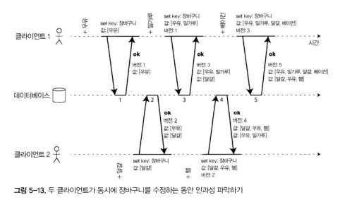

- 두 작업이 동시에 발생했는지, 아니면 하나가 다른 것보다 먼저 발생했는지 판단하는 방법을 다룸.  
- 단일 복제본을 가진 데이터베이스에서 시작해, 다중 복제본/리더 없는 DB로 일반화.
- 두 클라이언트가 동시에 장바구니에 상품을 추가하는 상황.
  1. 클라이언트 A: 우유를 추가, 서버는 첫 쓰기로 버전 1(`우유`) 저장.
  2. 클라이언트 B: 달걀 추가. B는 A의 쓰기를 모른 상태라 달걀만 있는 버전 2(`달걀`)을 저장.
     - 서버는 클라이언트에게 버전 2 반환.
  3. 클라이언트 A: 밀가루 추가. 이전 버전을 모르므로 `밀가루`만 있는 버전 3 저장.
  4. 클라이언트 B: 다시 우유와 달걀 추가. 이전 응답(버전 2)에 `우유` 추가 → 버전 4(`우유, 달걀`).
  5. 클라이언트 A: 베이컨 추가. 이전 버전 3(`밀가루`) 기반으로 `우유, 밀가루, 달걀, 베이컨` 상태 저장.
     - 서버는 최종적으로 버전 5를 유지.


- 도표 해석
  - 그림 5-13, 5-14는 작업 간 "이전 발생" 관계를 도식화.
    - 핵심: 어떤 작업이 다른 작업보다 먼저 발생했음을 표현할 수 있다면 인과 관계 존재
    - 동시에 발생해 순서를 알 수 없다면 단순히 동시 작업으로 간주

- 버전 관리와 충돌 처리
  - 서버: 각 키의 버전 번호를 기록. 새로운 값 저장 시 버전 번호 증가
  - 클라이언트: 쓰기 전 현재 버전(과 읽기 시 받은 모든 이전 버전)을 포함해 전송
  - 서버는 전달받은 버전을 비교해 이전 발생 관계를 추론하고 충돌 여부를 판단

_**동시에 쓴 값 병합**_

- 여러 클라이언트가 동시에 쓰기를 하면 충돌이 발생
  - 동시에 쓴 값을 합쳐 정리해야 함
  - 리악은 이를 형제(sibling) 값이라고 부름

- 형제 값 처리 방법
  - 단순 선택 방식
    - 버전 번호나 타임스탬프 기준으로 한 값을 선택(최종 쓰기 승리)
    - 간단하지만 데이터 손실 위험 있음 
      - 애플리케이션 코드에서 대체 필요
  - 합집합 방식
    - 장바구니 예시: 서로 다른 클라이언트가 동시에 상품 추가 
      - 모든 값을 병합
    - [우유, 밀가루], [달걀, 우유] 합집합 [우유, 밀가루, 달걀]
    - 병합된 결과를 새 버전으로 저장

  - 응용별 맞춤 병합
    - 단순한 합집합으로 처리할 수 없는 경우도 있음
    - 형제를 병합할 때 상품을 제거했음을 나타내기 위해 해당 버전 번호에 표시를 남겨둠
    - 이런 삭제 표시를 툼스톤(tombstone)이라 한다.

- 자동 병합 연구
  - 애플리케이션 코드에서 형제 병합은 복잡하고 오류 발생 위험 큼
  - Riak은 CRDT를 사용해 형제를 합리적으로 자동 병합

_**버전 벡터**_

- 다중 복제본 환경에서는 복제본마다 독립적으로 쓰기가 발생할 수 있음
  - 단일 복제본에서는 단일 버전 번호로 충분
  - 단순 버전 번호로는 부족
  - 따라서 복제본별 버전 번호를 추적해야 함

- 버전 벡터 (Version Vector)
  - 모든 복베존의 번호 모음을 버전 벡터라고 부른다.
  - 각 복제본이 쓰기를 처리할 때마다 자신만의 버전 번호를 증가
  - 각 복제본은 다른 복제본의 버전 번호도 추적하여 전체 상태를 기록

- 작동 방식
  - 클라이언트가 데이터를 읽으면, 그 시점의 버전 벡터가 함께 전달됨
  - 이후 데이터를 수정하고 다시 저장할 때 이 버전 벡터도 함께 전송 
     - 동시 쓰기 판별 가능
  - 데이터베이스는 버전 벡터를 기반으로 충돌 여부 판단