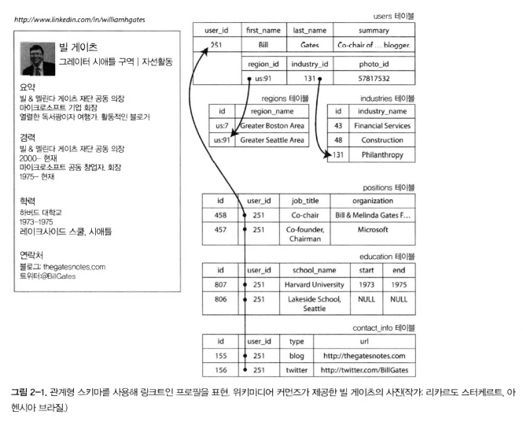
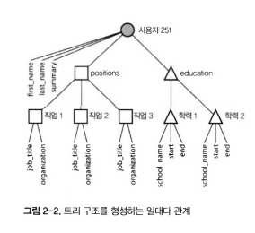

# 🔴 데이터 모델과 질의 언어

데이터 모델은 소프트웨어 개발에서 제일 중요한 부분이다.

데이터 모델을 표현하는 다양한 방법이 있는데

- 애플리케이션 개발자는 현실 객체나 데이터 구조, 그리고 이러한 데이터 구조를 다루는 API를 모델링 한다.
    - 보통의 애플리케이션 특화
- 데이터 구조를 저장할 때는 JSON, XML, RDB table, Graph 같은 범용 데이터 모델로 표현한다.
- JSON/XML/RDB/Graph 데이터를 메모리나 디스크 또는 네트워크 상 바이트 단위로 표현하는 방법을 결정한다.
    - 이를 통해 데이터를 질의, 탐색, 조작, 처리할 수 있게 한다.
- 더 낮은 수준에서 하드웨어 엔지니어는 전류, 빛의 파동, 자기장 등의 관점에서 바이트를 표현한다.

데이터 저장과 질의를 위한 다양한 범용 모델에 대해 살펴본다.

관계형 모델(relational model), 문서 모델(document model), 그래프 기반 모델(graph-based data model)을 비교하고 다양한 잘의 언어에 대해서도 알아보자.

## 🟠 관계형 모델과 문서 모델

### 🟢 관계형 모델

현재 가장 잘 알려지고 쓰이는 데이터 모델은 1970년 에드가 코드(Edgar Codd)가 제안한 관계형 모델이다.

데이터는 관계(relation)로 구성되고 각 row(=tuple)의 모음이다.

관계형 모델의 초기에는 이론적 제안이었고 많은 사람들이 효율적으로 구현할 수 있을지에 대해 의문을 가졌지만, 1980년대 중반부터 RDB와 SQL은 정규화된 구조로 데이터를 저장하고 질의해야하는 개발자들이 대부분 선택하는 도구가 되었다.

RDB의 근원은 1960년대와 1970년대에 비즈니스 데이터 처리에 있다. 보통 트랜잭션 처리(은행 거래, 항공 예약, 창고 보관)과 일괄 처리(송장 작성, 급여 지불, 보고)를 주로 처리하였다.

수년 동안 RDB와 다른 데이터 모델들이 경쟁을 했지만 결국 RDB가 우위를 차지했고 오늘날에는 비즈니스 뿐 아니라 대부분의 서비스(SNS, 전사 상거래, 게임, SaaS 등)에서 채택되고 있다.

### 🟢 NoSQL의 탄생

현대에 NoSQL은 RDB와 경쟁하는 최신 시도이다. NoSQL은 RDB에 비해 장점이 있었는데

1. 대규모 데이터셋이나 매우 높은 쓰기 처리량을 RDB보다 쉽게 할수 있는 뛰어난 확장성
2. 상용 데이터베이스 제품이 아닌 무료 오픈소스
3. RDB에서 지원하지 않는 특수 질의 동작
4. RDB 스키마 제한에 대한 불만과 더욱 동적이고 표현력이 풍부한 데이터 모델에 대한 바람

애플리케이션 마다 요구사항이 다르다. 그에 맞게 RDB와 NoSql을 함께 사용하게 될것이다. 이런 개념을 `다중 저장소 시속성(polyglot persistence)`라고 한다.

### 🟢 객체 관계형 불일치

객체지향 언어와 RDB는 코드와 데이터베이스 모델 객체 사이에 거추장스러운 전환 계층이 필요하다. 이런 모델 사이의 분리를 `임피던스 불일치(impedance mismatch)`라고 한다.

ORM을 통해 문제를 해결하려 하지만 두 모델 간의 차이를 완벽하기 숨기기엔 어려움이 있다.

예를 들어 이력서를 RDB로 저장한다면 아래와 같이 OneToMany의 관계를 가진다



이러한 관계는 RDB에서는 다양한 방법으로 나타낼 수 있다.

- 전통적인 SQL 모델에서 가장 일반적인 정규화 표현은 직위, 학력, 연락처, 정보를 개별 테이블에 넣고, 외래키로 users 테이블을 참조하는 방식이다.
- SQL 표준 마지막 버전에서 구조화된 datatype과 xml 데이터에 대한 지원을 추가했다.
  - 단일 로우에 다중 값을 저장할 수 있고 문서 내 질의와 색인이 가능해졌다.
  - 오라클, IBM DB2, MS SQL, Postgre 같은 DB마다 다양한 형태로 지원한다.
  - MySql의 경우도 JSON 타입을 저장할 수 있도록 지원하고 있다.
  
하지만 이력서와 같은 데이터는 JSON 표현이 더욱 잘 표현할 수 있다. 아래 예시 JSON 데이터를 보자.

(MongoDB, RethinkDB, CouchDB, Espresso와 같은 문서 지향 데이터베이스는 JSON 모델을 지원한다.)

```json
{
  "user_id": 251,
  "first_name": "Bill",
  "last_name": "Gates",
  "summary": "Co-chair of the Bill & Melinda Gates... Active blogger.",
  "region_id": "us:91",
  "industry_id": 131,
  "photo_url": "/p/7/000/253/05b/308dd6e.jpg",
  "positions": [
    { "job_title": "Co-chair", "organization": "Bill & Melinda Gates Foundation" },
    { "job_title": "Co-founder, Chairman", "organization": "Microsoft" }
  ],
  "education": [
    { "school_name": "Harvard University", "start": 1973, "end": 1975 },
    { "school_name": "Lakeside School, Seattle", "start": null, "end": null }
  ],
  "contact_info": {
    "blog": "http://thegatesnotes.com",
    "twitter": "http://twitter.com/BillGates"
  }
}
```

RDB에서는 여러 테이블을 join하여 가져와야 하지만 JSON 타입의 데이터는 모든 관련 정보가 한 곳에 있어 질의 하나로 충분하다.

이러한 일대다 관계는 데이터 트리 구조와 같다. 



### 🟢 다대일과 대다다 관계

앞의 예시에서 region_id, industry_id는 평문인 지역이름, 활동이름이 아닌 ID로 주어졌다 왜일까? 평문보다 ID를 사용하는 것이 장점이 존재한다.

- 일관된 스타일과 철자(도시 이름 표기 통일)
- 모호함 회피(동일한 이름의 여러 도시 방지)
- 갱신의 편의성(도시 이름이 바뀌는 경우 ID로 찾아 이름만 수정하면 됨)
- 현지화 지원(국가별 다르게 표시 가능)
- 더 나은 검색()

### 🟢  문서데이터베이스는 역사를 반복하고 있나?

### 🟢 네트워크 모델