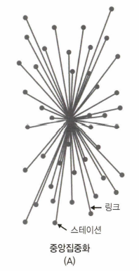
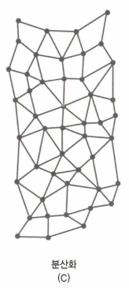
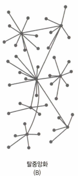

# 🔴 블록체인의 기원

## 🟠 전사시스템과 신뢰

### 🟢 인터넷

인터넷의 발전은 사람들의 삶을 완전히 바꿨다. 많은 정보와 서비스를 누구나 누릴 수 있는 세상이 되었다. 하지만 모든 정보에 대해 신뢰할 수 없었기에 신뢰를 할 수 있는 방법이 필요했다.

- 중개자 신뢰
  - 제 3자인 개인 또는 법인에 대한 신뢰
- 신탁 발행
  - 가치의 안전과 보안을 보장하기 위해 제 3자인 개인 또는 법인에 대한 신뢰로 의존한다

### 🟢 돈의 디지털화

금융 거래는 중개자의 신뢰와 발행자의 신뢰에 의존한다.

정부의 신뢰에 의존하여 `화폐` 라는 방식으로 정부에 의해 진행되었다.

현재는 은행, PG사의 신뢰에 의존하여 체크카드나 신용카드와 같은 전자 금융 도구를 통해 `전자 결제`를 진행하고 있다.

### 🟢 2008년 금융위기

금융위기로 인해 그동안 우리가 믿고 신뢰했던 `금융기관`들에 대한 신뢰와 믿음이 생각했던 것과 다르다는 생각을 하기 시작했다.

또한 정부 정책에 의해 부동산 값이 폭등하거나 폭락하며 화폐의 가치가 다른 가치에 의존적으로 변형되며 `정부`에 대한 금전적인 신뢰와 믿음 또한 다르다는 것을 생각하기 시작했다. 

## 🟠 중앙집중화, 분산화, 탈중앙화

### 🟢 중앙집중화

페이팔과 같은 중앙집중화 시스템은 다음과 같이 하나의 데이터베이스에서 모든 것을 관리한다.




### 🟢 분산화

AWS의 분산된 데이터베이스는 다음과 같이 복제본을 유지하며 관리한다.




### 🟢 탈중앙화

비트코인은 다음과 같이 익명의 많은 개체들에 의해 제어된다.




## 🟠 비트코인이 되기까지의 과정

비트코인은 하루 아침에 짠 하고 나타난 것이 아니다. 비트코인이 등장하기 위해 선행 연구자들은 비슷한 개념을 만드려고 시도했고 실패했다.

### 🟢 디지캐시

온라인에서 익명 디지털 결제가 가능한 서비스였다. 사생활에 민감했던 사용자들이 이용하기도 했지만 당시에는 디지털 거래 자체가 낯선 시대였기에 시대에 장벽에 부딪혀 회사가 파산하여 사라졌다.

### 🟢 E골드

실제 귀금속 단위를 통해 결제가 가능하다록 했다. 예를 들어 금 1만분의 1그램과 같은 표시로 상품의 가치를 귀금속으로 처리한 것이다.

하지만 당시 기술로는 개인의 계정과 개인의 정보를 연결할 기술력이 부족했고 사이트는 악의적인 불법 활동에 사용되며 미국 정부로 부터 폐쇄처리되었다.

### 🟢 해시캐시

디지털 자금의 타당성 확보를 위해 증명이라는 방식을 도입하였다. 스팸 메일의 문제를 해결하기 위해 메일에 해시 알고리즘을 적용하여 이메일에 수수료나 요금을 부과하는 방법을 적용하려 하였다.

해시캐시는 디지털에서 희소성을 어떻게 도입하는지 보여주는 좋은 사례가 되었지만 화폐적으로는 좋은 형태가 아니였기에 실패하였다.

### 비트골드

비트골드의 아이디어는 귀금속의 희소성을 디지털 영역으로 가져오는 것이다. 닉 재보는 금은 비용을 조작하기가 매우 어렵다고 생각했고 금의 가치를 디지털로 만들어내고 싶어했다.

디지털 가치를 뒷받침하기 작업 증명 중 클라이언트 퍼즐 함수 유형을 활용했다. 사용자의 클라이언트 퍼즐 함수는 컴퓨터에 생성된 도전 문자열을 사용해 분산된 방식으로 안전하게 타임스탬프를 표시하는 방법이다.

## 🟠 사토시 나가모토의 등장

### 🟢 백서

2008년 8월 18일 bitcoin.org 도메인의 등록과 함께 사토시 나카모토는 10월 31일 백서를 작성해 수많은 소프트웨어 개발자에게 메일로 공유하였다.

인터넷에만 존재하는 가치 시스템을 만들기 위한 구체적인 방안을 제시한 내용이였고 은행이나 정부와 연결 없이 운영할 수 있는 디지털 화폐를 만들어 투명한 금융 시스템을 구축하자는 것이였다.

```text
- 비트콜드(닉 재보)가 설명한 스마트 콘트랙트와 같은 안전한 디지털 거래
- 디지캐시와 같은 거래를 확보하기 위해 암호를 사용
- E골드처럼 적은 양의 안전한 가치를 보낼 수 있는 이론적인 능력
- 비머니가 제안한 것과 같이 정부 시스템 밖에서 돈을 창출
- 해시캐시가 설계한 것과 같이 디지털 자금의 유효성 검증하기 위한 작업 증명 사용
```

### 🟢 타임스탬프 서버 소개

사토시는 비트코인 네트워크 작업 증명서를 사용하는 것 외에도 파일 시스템 및 DB와 유사한 트랜잭션을 검증하기 위해 타임스탬프 시스템을 사용할 것을 제안했다.

트랜잭션 중에 생성된 정보를 해시 알고리즘을 사용해 실행하면 해시가 생성되고 해당 값을 통해 증명을 하는 것이다.

### 🟢 개념

- Coinbase Transaction
  - 네트워크에서 채굴된 새로운 블록의 첫 트랜잭션이다.
- Block hight number
  - 현재 블록과 체인의 첫 번째 블록(genesis block) 사이에 얼마나 많은 블록이 있는지 식별한다
- Merkle root
  - 블록체인의 유효성을 증명할 수 있는 해시 값이다

### 🟢 사토시의 실종으로 완벽해진 비트코인

사토시는 현재 누구인지 어떤 사람인지 아무도 모른다. 그로인해 다른 코인들(이더리움, 리플 등)과는 다르게 리더가 없다. 그렇기 때문에 완벽한 탈중앙화된 코인으로서 존재할 수 있다.

### 🟢 공개키와 개인키

비트코인은 공개키와 개인키를 통해 거래의 타당성을 증명한다. 개인키는 비트코인 거래에 디지털 서명에 쓰이고 소유자가 해당 주소의 정당한 소유자임을 네트워크 상에서 증명하는데 사용된다.

또한 개인키를 통해 거래를 승인하는데 쓰인다. 개인키는 비밀번호처럼 사용돼 비밀키라고 한다.

공개키는 비트코인 주소를 생성하는데 사용된다. 보통 누군가에게 비트코인을 보내라고 하면 상대방과 주소를 공유하여 비트코인을 공유하는 부분에 사용된다.